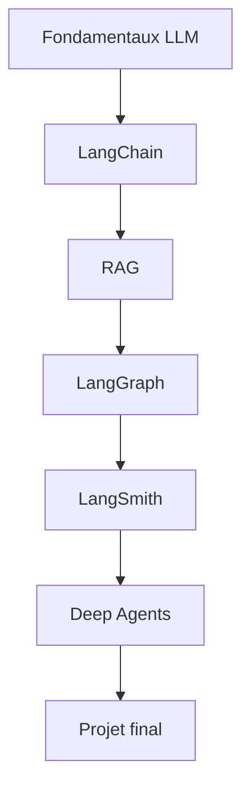

# De LangChain aux Deep Agents

[](https://github.com/Simo-Mesbahi/longChain-RAG-longGraph-longServe-DeepAgents/actions/workflows/ci.yml)
[](https://www.python.org/)
[](https://docs.langchain.com/oss/python/langchain/overview)
[](LICENSE)

Cours open source en francais pour apprendre a construire des applications LLM robustes, de la premiere invocation d'un modele jusqu'aux agents stateful et aux Deep Agents.

> Le cours privilegie la comprehension, l'experimentation et les pratiques de production. Chaque notion est accompagnee de code executable, d'exercices, de tests et d'un projet progressif.

## Objectifs

A la fin du parcours, vous saurez :

- expliquer le fonctionnement pratique d'un LLM et ses limites ;
- construire des applications avec LangChain ;
- imposer des sorties structurees et valider les reponses ;
- concevoir et evaluer un pipeline RAG ;
- orchestrer des workflows stateful avec LangGraph ;
- tracer, tester et surveiller une application avec LangSmith ;
- construire des Deep Agents avec planification, memoire et sous-agents ;
- transformer un prototype en application testable et deployable.

## Parcours

| Module | Sujet | Livrable principal | Statut |
|---:|---|---|:---:|
| 00 | Python, API et fondamentaux LLM | Premier appel fiable | Disponible |
| 01 | LangChain : modeles, prompts et LCEL | Assistant pedagogique | Disponible |
| 02 | Sorties structurees et outils | Extracteur type | A venir |
| 03 | Fondamentaux RAG | Questions-reponses avec sources | A venir |
| 04 | RAG avance et evaluation | RAG mesure et optimise | A venir |
| 05 | LangGraph | Workflow stateful controle | A venir |
| 06 | LangSmith | Traces et evaluations | A venir |
| 07 | Deep Agents | Agent long avec sous-agents | A venir |
| 08 | Production et migration LangServe | API et strategie de migration | A venir |
| 09 | Projet final | Assistant d'investigation documentaire | A venir |

LangServe est conserve comme sujet de culture et de migration. Il est deprecie pour les nouveaux projets ; le chemin principal du cours s'appuie sur les outils actuels de l'ecosysteme LangChain.

## Demarrage rapide

### 1. Recuperer le projet

```bash
git clone https://github.com/Simo-Mesbahi/longChain-RAG-longGraph-longServe-DeepAgents.git
cd longChain-RAG-longGraph-longServe-DeepAgents
```

### 2. Creer l'environnement

Avec `uv` :

```bash
uv venv
source .venv/bin/activate
uv pip install -e ".[dev]"
```

Avec `pip` :

```bash
python -m venv .venv
source .venv/bin/activate
python -m pip install --upgrade pip
pip install -e ".[dev]"
```

Sous Windows, l'activation se fait avec `.venv\\Scripts\\activate`.

### 3. Configurer les variables

```bash
cp .env.example .env
```

Ajoutez ensuite votre cle dans `.env`. Ne publiez jamais ce fichier.

### 4. Executer le premier exemple

```bash
python course/01-langchain-basics/examples/first_chain.py "Explique le RAG simplement"
```

### 5. Verifier le projet

```bash
ruff check .
pytest
```

## Methode pedagogique

Chaque module suit le meme rythme :

1. **Comprendre** : vocabulaire, intuition et architecture.
2. **Observer** : exemple minimal explique ligne par ligne.
3. **Construire** : exercice guide puis exercice autonome.
4. **Verifier** : tests, criteres de reussite et erreurs frequentes.
5. **Produire** : mini-projet presentable sur GitHub.



## Projet final

Le fil rouge sera un **assistant d'investigation documentaire en assurance**. Il devra rechercher des preuves dans des contrats et dossiers, produire une reponse citee, expliquer ses limites, demander une validation humaine lorsque necessaire et conserver une trace evaluable de son execution.

## Documentation

- [Installation detaillee](docs/getting-started.md)
- [Programme complet](docs/curriculum.md)
- [Glossaire](docs/glossary.md)
- [Feuille de route](ROADMAP.md)
- [Guide de contribution](CONTRIBUTING.md)

## Sources et versions

Le contenu suit les documentations officielles de LangChain. L'ecosysteme evolue rapidement : les dependances sont bornees par version majeure et les changements importants sont documentes dans le [changelog](CHANGELOG.md).

## Licence

Le code et le contenu pedagogique de ce depot sont distribues sous licence [MIT](LICENSE).

