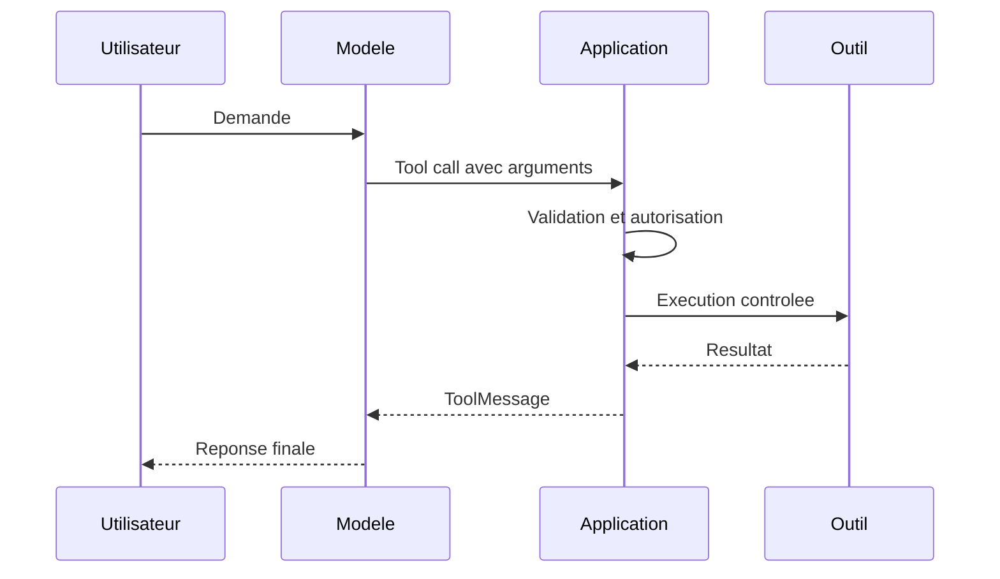

# Module 02 - Sorties structurees et outils

## Objectifs

A la fin de ce module, vous saurez :

- expliquer pourquoi une reponse JSON demandee dans un prompt reste fragile ;
- definir un contrat de sortie avec Pydantic ;
- utiliser `with_structured_output` sur un modele LangChain ;
- creer un outil avec un schema d'entree explicite ;
- distinguer la demande d'un outil de son execution reelle ;
- valider les arguments et refuser un outil inconnu.

## 1. Du texte libre au contrat type

Une reponse libre est adaptee a une conversation, mais difficile a utiliser dans une application. Le modele peut renommer une cle, oublier un champ ou retourner un montant sous forme de texte.

```json
{
  "montant": "environ mille euros",
  "date": "la semaine derniere"
}
```

Demander "reponds en JSON" ameliore souvent le format, sans le garantir. Une sortie structuree ajoute un schema connu par le modele et une validation dans le code.

```python
from pydantic import BaseModel, Field


class ClaimExtraction(BaseModel):
    claim_id: str | None
    amount_eur: float | None = Field(default=None, ge=0)
    summary: str = Field(min_length=10)
```

Pydantic controle ici les types et les contraintes. Une valeur negative pour `amount_eur` provoque une erreur de validation au lieu de circuler silencieusement dans le systeme.

## 2. `with_structured_output`

LangChain permet d'associer directement le schema au modele :

```python
structured_model = model.with_structured_output(ClaimExtraction)
result = structured_model.invoke(document)

print(type(result))
print(result.amount_eur)
```

Avec un schema Pydantic, `result` est une instance validee de `ClaimExtraction`, pas une chaine JSON a parser manuellement.

Selon le modele, le fournisseur peut imposer le schema nativement ou LangChain peut utiliser le tool calling. Il faut verifier les capacites du modele choisi.

## 3. Validation syntaxique et validation metier

Un type correct ne garantit pas une decision correcte.

| Validation | Exemple | Responsable |
|---|---|---|
| Syntaxique | `amount_eur` est un nombre positif | Pydantic |
| Structurelle | les champs obligatoires sont presents | Pydantic |
| Metier | le montant est coherent avec le contrat | Code metier |
| Semantique | le resume correspond vraiment au document | Evaluation |
| Decisionnelle | une revue humaine est necessaire | Politique metier |

Le schema du cours verifie aussi que `missing_fields` correspond exactement aux champs absents. Cette contrainte est implementee par un `model_validator`.

## 4. Qu'est-ce qu'un outil ?

Un outil associe :

1. un nom ;
2. une description ;
3. un schema d'arguments ;
4. une fonction executable.

```python
from langchain.tools import tool


@tool
def get_claim_status(claim_id: str) -> dict[str, str]:
    """Return the current workflow status for one claim."""
    ...
```

La description et les annotations aident le modele a choisir l'outil et a construire ses arguments.

## 5. Le cycle du tool calling



Le modele propose un appel. L'application decide de l'accepter, de le modifier, de demander une validation humaine ou de le refuser.

Avec un modele utilise seul, `bind_tools` expose les outils mais n'execute pas la boucle :

```python
model_with_tools = model.bind_tools([get_claim_status])
response = model_with_tools.invoke("Quel est le statut de CLM-123456 ?")

for tool_call in response.tool_calls:
    print(tool_call["name"], tool_call["args"])
```

Un agent peut automatiser cette boucle. Nous etudierons les agents et leurs garde-fous plus tard.

## 6. Securite

Avant d'executer un tool call :

- autoriser uniquement les noms d'outils attendus ;
- valider les arguments avec un schema strict ;
- limiter les droits de l'outil ;
- distinguer lecture et ecriture ;
- demander une validation humaine pour une action sensible ;
- tracer l'appel, son resultat et ses erreurs ;
- ne jamais placer un secret dans le prompt ou le resultat.

Dans ce module, l'outil est en lecture seule et utilise des donnees fictives.

## 7. Gestion des erreurs

Il faut distinguer :

- une erreur temporaire du fournisseur, parfois eligible a un retry ;
- une sortie non conforme au schema ;
- une regle metier violee ;
- un outil inconnu ou non autorise ;
- une erreur interne de l'outil.

Un retry automatique n'est pas adapte a toutes les situations. Reexecuter une operation d'ecriture non idempotente peut produire un doublon. Pour une action sensible, la strategie doit etre explicite.

## Executer les exemples

Extraction structuree avec un modele :

```bash
python course/02-structured-output-and-tools/examples/extract_claim.py
```

Demande et execution controlee d'un outil :

```bash
python course/02-structured-output-and-tools/examples/tool_calling.py \
  "Quel est le statut de CLM-123456 ?"
```

Ces exemples utilisent le fournisseur configure dans `.env` et peuvent entrainer un cout API.

## A retenir

- Un prompt de formatage n'est pas un contrat.
- Pydantic valide la structure, pas la verite du contenu.
- Le modele demande un outil ; l'application controle son execution.
- Une action a impact eleve exige des garde-fous hors du prompt.

Passez maintenant aux [exercices](exercises.md), puis au [quiz](quiz.md).

## References officielles

- [LangChain - Structured output](https://docs.langchain.com/oss/python/langchain/structured-output)
- [LangChain - Models and tool calling](https://docs.langchain.com/oss/python/langchain/models)
- [LangChain - Tools](https://docs.langchain.com/oss/python/langchain/tools)
