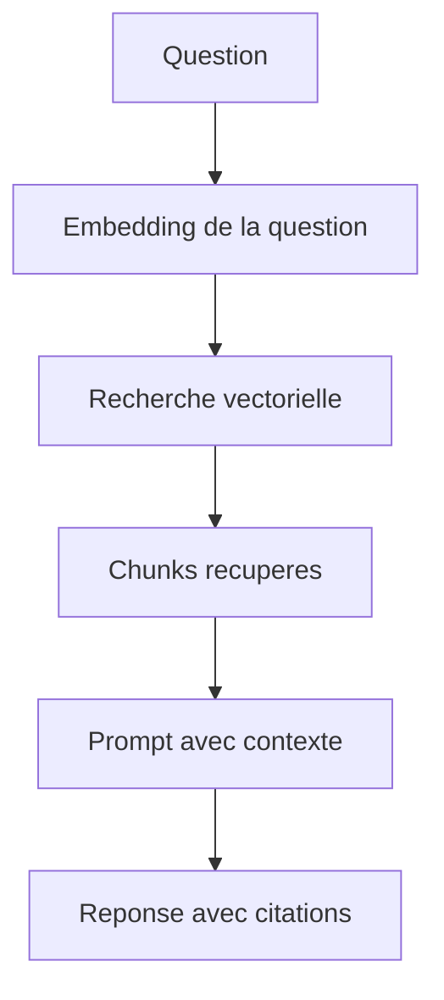

# Module 03 - Fondamentaux RAG

## Objectifs

A la fin de ce module, vous saurez :

- expliquer pourquoi un LLM seul ne suffit pas pour interroger des documents ;
- representer un texte avec `Document` et ses metadonnees ;
- decouper un document en chunks avec chevauchement ;
- expliquer le role des embeddings et de la similarite ;
- indexer et rechercher des chunks dans un vector store ;
- construire une reponse limitee aux preuves recuperees ;
- valider les citations et refuser de repondre sans preuve suffisante.

## 1. Qu'est-ce que le RAG ?

RAG signifie **Retrieval-Augmented Generation**. Avant de demander au modele de repondre, l'application recherche des passages pertinents dans une collection controlee.



Le RAG n'entraine pas le modele et ne modifie pas ses poids. Il construit un contexte specifique a chaque question.

## 2. Pipeline d'indexation

L'indexation est generalement executee avant les questions :

1. charger les sources ;
2. nettoyer et normaliser le contenu ;
3. creer des objets `Document` avec metadonnees ;
4. decouper les documents ;
5. calculer les embeddings des chunks ;
6. enregistrer les vecteurs et leurs metadonnees.

```python
from langchain_core.documents import Document

document = Document(
    page_content="Contenu du contrat...",
    metadata={"source": "contrat-123.pdf", "page": 4},
)
```

Les metadonnees permettent de filtrer, auditer et citer. Une source perdue pendant l'indexation ne pourra pas etre reconstruite de facon fiable au moment de la reponse.

## 3. Chunking

Envoyer un document entier est souvent couteux et moins precis. On le divise en passages assez petits pour etre cibles, mais assez grands pour conserver le sens.

```python
from langchain_text_splitters import RecursiveCharacterTextSplitter

splitter = RecursiveCharacterTextSplitter(
    chunk_size=500,
    chunk_overlap=75,
    add_start_index=True,
)
chunks = splitter.split_documents([document])
```

`RecursiveCharacterTextSplitter` essaie d'abord de conserver les paragraphes, puis les lignes, les mots et enfin les caracteres. Le chevauchement reduit le risque de couper une information a la frontiere de deux chunks.

Il n'existe pas de taille parfaite pour tous les corpus. Elle depend du type de document, du modele d'embedding et des questions attendues.

## 4. Embeddings

Un embedding transforme un texte en vecteur numerique. Les textes proches par le sens doivent produire des vecteurs proches selon une mesure comme la similarite cosinus.

Le cours propose deux implementations :

- `OpenAIEmbeddings` pour l'exemple reel ;
- `HashingEmbeddings` pour les tests locaux deterministes.

`HashingEmbeddings` reconnait surtout les mots communs et ne remplace pas un modele semantique. Son role est de rendre les tests rapides, gratuits et reproductibles.

## 5. Vector store et retrieval

```python
from langchain_core.vectorstores import InMemoryVectorStore

vector_store = InMemoryVectorStore(embedding=embeddings)
vector_store.add_documents(chunks)
matches = vector_store.similarity_search_with_score(question, k=4)
```

`k` limite le nombre de candidats. Un nombre trop faible peut manquer une preuve ; un nombre trop eleve ajoute du bruit, du cout et des contradictions.

Le module applique aussi `min_score`. Ce seuil depend du vector store, de la metrique et du modele d'embedding. Il doit etre calibre sur un jeu d'evaluation, et non copie depuis un tutoriel.

## 6. Generation fondee sur les preuves

Le contexte transmis au modele contient un identifiant stable pour chaque chunk :

```text
[insurance_guide.md#chunk-002]
Source: insurance_guide.md
Apres un vol, l'assure doit fournir...
```

La sortie structuree demande :

- `answer` : la reponse ;
- `cited_chunk_ids` : les chunks utilises ;
- `answerable` : indique si le contexte suffit.

Le code refuse toute citation absente des resultats du retrieval. Le modele choisit les chunks qu'il utilise, mais il ne peut pas creer une source valide par simple invention.

## 7. Quand refuser de repondre ?

Le pipeline retourne une reponse standard lorsque :

- aucun chunk ne depasse le seuil ;
- le modele indique que le contexte ne suffit pas ;
- une reponse declaree answerable ne contient aucune citation.

Une citation correcte ne prouve toutefois pas que l'interpretation est correcte. L'evaluation de la fidelite viendra dans le module 04.

## 8. Les erreurs a distinguer

| Probleme | Brique concernee | Exemple de mesure |
|---|---|---|
| Le bon passage n'est pas retrouve | Retrieval | Recall@k |
| Trop de passages inutiles | Retrieval | Precision@k |
| La reponse contredit les passages | Generation | Fidelite |
| La reponse ignore une partie utile | Generation | Completude |
| La citation n'existe pas | Contrat applicatif | Validation stricte |

Une mauvaise generation ne se corrige pas toujours avec un meilleur retriever. De meme, un modele plus puissant ne peut pas utiliser une preuve qui n'a jamais atteint son contexte.

## Executer les exemples

Recherche locale sans cle API :

```bash
python course/03-rag-fundamentals/examples/search_offline.py \
  "Quels justificatifs fournir apres un vol ?"
```

Pipeline complet avec embeddings et modele OpenAI :

```bash
python course/03-rag-fundamentals/examples/ask_rag.py \
  "Un score automatique prouve-t-il une fraude ?"
```

Le second exemple utilise votre cle API et peut entrainer un cout.

## Limites de cette premiere version

- `InMemoryVectorStore` ne persiste pas apres l'arret du programme ;
- un seul fichier Markdown est indexe ;
- les scores ne sont pas encore calibres sur un dataset ;
- il n'y a ni recherche hybride ni reranking ;
- la fidelite des reponses n'est pas encore mesuree automatiquement.

Ces points seront traites dans le module 04 et le projet RAG.

Passez aux [exercices](exercises.md), puis au [quiz](quiz.md).

## References officielles

- [LangChain - Semantic search and RAG](https://docs.langchain.com/oss/python/langchain/knowledge-base)
- [LangChain - Text splitters](https://docs.langchain.com/oss/python/integrations/splitters)
- [LangChain - Embeddings](https://docs.langchain.com/oss/python/integrations/embeddings)
- [LangChain - Vector stores](https://docs.langchain.com/oss/python/integrations/vectorstores)
