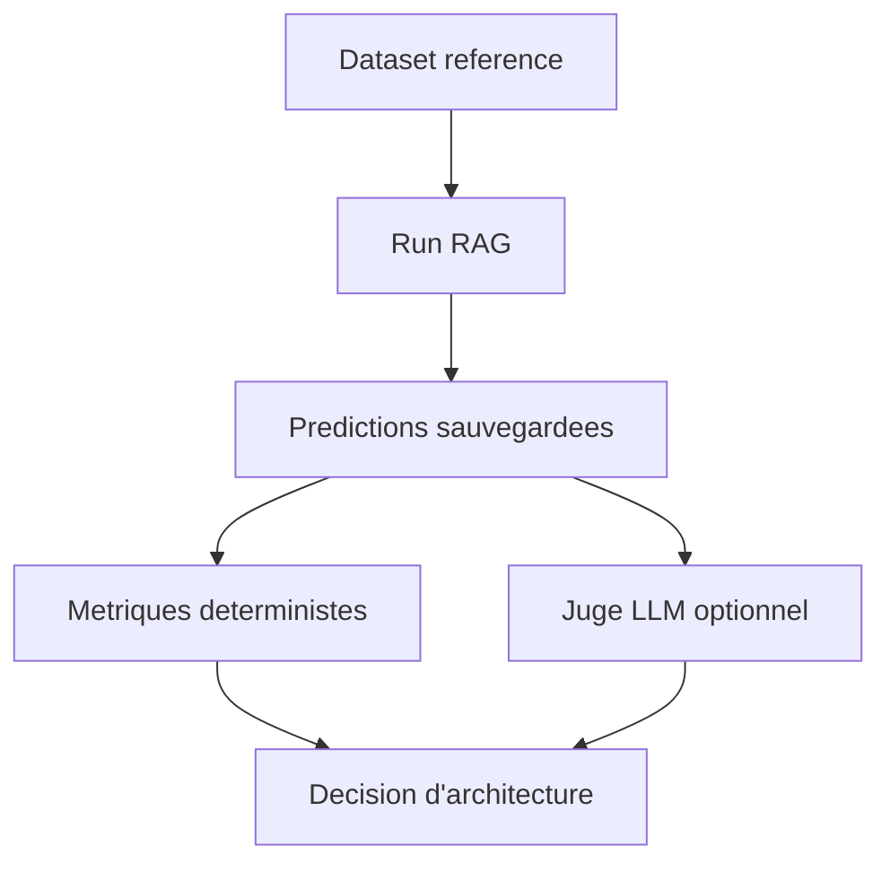

# Module 04 - RAG avance et evaluation

## Objectifs

A la fin de ce module, vous saurez :

- separer clairement evaluation du retrieval et evaluation de la generation ;
- mesurer la correction, la fidelite, la completude et le refus de repondre ;
- construire un dataset de questions avec reponses de reference ;
- sauvegarder des predictions pour comparer plusieurs versions d'un pipeline RAG ;
- utiliser des metriques deterministes sans API ;
- brancher un juge LLM structure sans le confondre avec un test unitaire ;
- analyser les erreurs avant de modifier le chunking, le `k`, le seuil ou le prompt.

## 1. Pourquoi le RAG avance ?

Le module 03 a construit le pipeline minimal : charger, decouper, indexer, retrouver, generer
et valider les citations. Ce module ajoute une question de production :

> Comment prouver qu'une nouvelle configuration RAG est meilleure que l'ancienne ?

Sans evaluation, on finit par choisir au feeling : un chunk plus long "semble" mieux, un seuil
plus haut "semble" plus prudent, un prompt plus strict "semble" reduire les hallucinations.
L'evaluation remplace cette impression par des cas versionnes et des mesures comparables.



## 2. Deux niveaux a ne pas melanger

Un RAG peut echouer a deux endroits differents.

| Niveau | Question | Exemples de metriques |
|---|---|---|
| Retrieval | Les bons passages arrivent-ils dans le contexte ? | Hit Rate@k, Recall@k, MRR |
| Generation | La reponse utilise-t-elle correctement les passages ? | correction, fidelite, completude, refus |

Si le bon document n'est jamais retrouve, le modele ne peut pas l'utiliser. Si le bon document
est present mais la reponse le contredit, augmenter `k` ne corrige pas le vrai probleme.

## 3. Dataset de reference

Un dataset utile contient au minimum :

- un `id` stable ;
- la `question` ;
- `answerable`, pour distinguer questions repondables et questions hors corpus ;
- les `expected_sources` pour le retrieval et les citations ;
- une `reference_answer` pour les questions repondables.

Exemple JSONL :

```json
{"id":"fraud-score","question":"Un score de risque eleve prouve-t-il une fraude ?","expected_sources":["fraud-review-policy.md"],"answerable":true,"reference_answer":"Non. Le score sert uniquement a prioriser et une validation humaine fondee sur des preuves est requise."}
```

Le dataset n'a pas besoin d'etre enorme au debut. LangSmith recommande de commencer par des
exemples manuellement verifies qui definissent ce que "bon" veut dire pour l'application.

## 4. Predictions sauvegardees

La generation LLM est non deterministe et peut couter de l'argent. Pour comparer proprement deux
versions, on sauvegarde les predictions produites par chaque configuration.

```json
{"id":"fraud-score","answer":"Non. Un score de risque eleve sert seulement a prioriser le dossier ; une validation humaine fondee sur des preuves reste obligatoire.","answered":true,"cited_sources":["fraud-review-policy.md"],"cited_chunk_ids":["fraud-review-policy.md#chunk-000"]}
```

Le fichier de predictions devient un artefact d'experience. Vous pouvez le relire, le commenter,
le comparer a une autre version et le passer a un juge LLM sans relancer tout le pipeline.

## 5. Metriques deterministes

Le module fournit `ai_course.rag_evaluation`, qui calcule sans API :

| Metrique | Role |
|---|---|
| `answerability_accuracy` | Le systeme repond-il seulement quand la question est repondable ? |
| `citation_precision` | Les sources citees sont-elles parmi les sources attendues ? |
| `citation_recall` | Toutes les sources attendues sont-elles citees ? |
| `lexical_f1` | La reponse partage-t-elle les informations attendues avec la reference ? |
| `error_tags` | Etiquettes lisibles : `false_refusal`, `answered_unanswerable`, `missing_expected_source`, etc. |

`lexical_f1` est volontairement modeste. Il repere des regressions simples, mais ne comprend pas
les synonymes, les paraphrases complexes ou les erreurs de raisonnement. Il ne remplace donc pas
une revue humaine ou un juge LLM calibre.

## 6. Juge LLM

Un juge LLM peut evaluer des criteres plus proches du jugement humain :

- **correction** : la reponse est-elle compatible avec la reference ?
- **fidelite** : chaque affirmation importante est-elle soutenue par les preuves ?
- **completude** : la reponse couvre-t-elle les elements importants ?

Le cours expose `build_rag_judge(model)`, qui demande une sortie structuree :

```python
from ai_course.langchain_basics import create_chat_model
from ai_course.rag_evaluation import build_rag_judge, evaluate_generation
from ai_course.settings import load_settings

judge = build_rag_judge(create_chat_model(load_settings()))
summary = evaluate_generation(examples, predictions, judge=judge)
```

Un juge LLM reste un modele : il peut se tromper, etre sensible au prompt, varier selon la
version et couter de l'argent. Pour cette raison, les scores deterministes restent en CI, tandis
que les juges LLM servent aux evaluations offline plus riches et aux revues periodiques.

## 7. Optimiser une configuration RAG

Avant de modifier le prompt, inspectez le retrieval :

| Levier | Effet possible | Risque |
|---|---|---|
| `chunk_size` plus petit | Passages plus precis | Perte de contexte |
| `chunk_size` plus grand | Plus de contexte local | Bruit et cout |
| `chunk_overlap` plus grand | Moins de coupures aux frontieres | Duplication |
| `k` plus grand | Meilleur recall potentiel | Plus de bruit |
| `min_score` plus haut | Moins de passages faibles | Faux refus |
| filtres metadata | Recherche plus ciblee | Source pertinente exclue |
| reranking | Meilleur ordre final | Latence et complexite |

La bonne decision depend des erreurs observees. Si les sources attendues sont absentes, travaillez
sur chunking, embeddings, filtres ou recherche hybride. Si elles sont presentes mais mal utilisees,
travaillez sur prompt, schema de sortie, juge, citations et post-validation.

## 8. Analyse d'erreurs

Une moyenne peut cacher le probleme. Lisez toujours les cas individuels :

- question repondable refusee ;
- question hors corpus acceptee ;
- bonne reponse sans citation ;
- citation valide mais source non attendue ;
- reponse proche lexicalement mais non fidele ;
- reponse fidele mais incomplete.

Les `error_tags` sont faits pour ca. Ils orientent le prochain changement au lieu de produire un
score global difficile a interpreter.

## Executer les exemples

Evaluation locale de predictions sauvegardees :

```bash
python course/04-advanced-rag/examples/evaluate_generation_offline.py
```

Comparaison de plusieurs configurations de retrieval sur le projet documentaire :

```bash
python course/04-advanced-rag/examples/compare_retrieval_configs.py
```

Evaluation avec juge LLM, optionnelle et payante :

```bash
python course/04-advanced-rag/examples/evaluate_with_llm_judge.py
```

Le projet 02 expose aussi la commande directe :

```bash
python projects/02-documentary-rag-assistant/app.py evaluate-generation
```

## Limites

- Les metriques deterministes ne comprennent pas toute la semantique.
- Un juge LLM doit etre calibre avec des exemples humains.
- Les evaluations offline ne remplacent pas l'observabilite en production.
- Le module n'utilise pas encore les datasets geres LangSmith ; ils arrivent au module 06.
- Le corpus reste fictif et volontairement petit pour rester publiable et reproductible.

Passez aux [exercices](exercises.md), puis au [quiz](quiz.md).

## References officielles

- [LangSmith - Evaluation concepts](https://docs.langchain.com/langsmith/evaluation-concepts)
- [LangSmith - Evaluate a RAG application](https://docs.langchain.com/langsmith/evaluate-rag-tutorial)
- [LangSmith - Evaluation approaches](https://docs.langchain.com/langsmith/evaluation-approaches)
- [LangSmith - Evaluate intermediate steps](https://docs.langchain.com/langsmith/evaluate-on-intermediate-steps)
