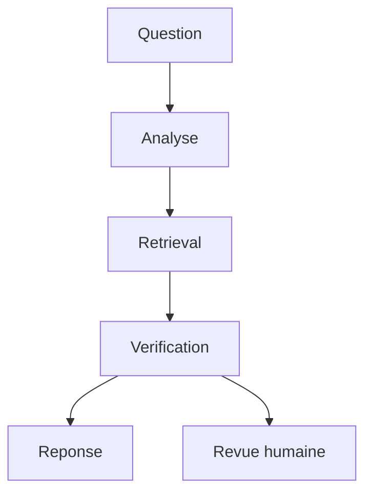

# Module 05 - LangGraph

## Objectifs

A la fin de ce module, vous saurez :

- expliquer pourquoi LangGraph existe dans l'ecosysteme LangChain ;
- modeliser un workflow comme un graphe d'etat ;
- distinguer l'etat, les noeuds, les aretes et les routeurs ;
- creer un `StateGraph` avec `START`, `END` et des transitions conditionnelles ;
- ajouter un checkpointer pour conserver l'etat d'un thread ;
- utiliser `interrupt()` et `Command(resume=...)` pour une validation humaine ;
- garder les decisions critiques dans du code testable plutot que dans un prompt flou.

## 1. Pourquoi LangGraph ?

LangChain aide a composer des appels modele, prompts, outils et retrievers. LangGraph ajoute une
couche d'orchestration : durable execution, etat partage, streaming, interruptions et human-in-
the-loop.

L'idee importante n'est pas de "faire un agent" partout. LangGraph sert surtout a rendre les
etapes explicites.



Dans un bon workflow, certaines decisions sont deterministes :

- faut-il refuser si aucune preuve n'est trouvee ?
- faut-il demander une validation humaine ?
- quelles citations sont autorisees ?
- quel chemin suit le dossier ?

Ces decisions doivent etre testables.

## 2. Les quatre concepts

| Concept | Role | Exemple |
|---|---|---|
| State | Memoire partagee du graphe | question, preuves, statut, citations |
| Node | Fonction qui lit l'etat et retourne une mise a jour | analyser la question |
| Edge | Transition fixe entre deux noeuds | analyse -> retrieval |
| Conditional edge | Routeur qui choisit le prochain noeud | verifier -> repondre ou revue humaine |

Les noeuds peuvent appeler un LLM, un retriever, une API ou du code classique. Une architecture
propre ne met pas toute la logique dans un seul noeud "agent".

## 3. Etat typé

Dans le module, l'etat est un `TypedDict`. Certains champs sont remplaces par la derniere valeur,
et `audit_trail` est append-only grace a un reducer.

```python
from typing import Annotated, TypedDict
import operator


class InvestigationState(TypedDict, total=False):
    question: str
    evidence_status: str
    answer: str
    audit_trail: Annotated[list[str], operator.add]
```

L'etat doit contenir des donnees utiles, pas seulement du texte formate. Par exemple, garder
`citations` comme liste structuree permet de les verifier et de les afficher ailleurs.

## 4. Noeuds purs et petits

Un noeud LangGraph est une fonction. Il recoit l'etat courant et retourne seulement les champs a
mettre a jour.

```python
def analyze_question(state: InvestigationState) -> dict[str, object]:
    question = state["question"]
    return {
        "normalized_question": " ".join(question.split()),
        "audit_trail": ["analyze_question"],
    }
```

Un noeud facile a tester doit avoir une responsabilite claire. Si un noeud analyse, recupere des
documents, decide, genere et logge en meme temps, il devient difficile a debugger.

## 5. Routage conditionnel

Le module implemente ce chemin :

1. `analyze_question`
2. `retrieve_evidence`
3. `verify_evidence`
4. route vers `draft_answer`, `draft_refusal` ou `request_human_review`

```python
builder.add_conditional_edges("verify_evidence", route_after_verification)
```

Le routeur ne doit pas produire une reponse. Il choisit seulement le prochain noeud a executer.
C'est ce qui rend le graphe lisible.

## 6. Checkpointer et memoire courte

Un checkpointer sauvegarde les checkpoints d'un thread. Il sert a reprendre une execution, a
inspecter un etat intermediaire et a faire du human-in-the-loop.

```python
from langgraph.checkpoint.memory import InMemorySaver

graph = builder.compile(checkpointer=InMemorySaver())
graph.invoke(
    {"question": "Un score prouve-t-il une fraude ?"},
    {"configurable": {"thread_id": "case-001"}},
)
```

`InMemorySaver` convient pour apprendre et tester. En production, il faut un stockage durable
adapte a l'application.

## 7. Interruptions et validation humaine

`interrupt()` met le graphe en pause et expose une charge JSON-serializable au caller. La reprise
se fait avec `Command(resume=...)`.

```python
from langgraph.types import Command

first_state = graph.invoke(input_state, config)
final_state = graph.invoke(
    Command(resume={"approved": True, "notes": "Validation OK."}),
    config,
)
```

Dans notre workflow, la revue humaine est demandee lorsque :

- aucune preuve suffisante n'est trouvee ;
- une question sensible a des preuves trop faibles ;
- la politique choisie l'impose.

Ce pattern est plus defendable qu'un agent qui decide seul de refuser ou d'approuver un dossier.

## 8. Garde-fous d'architecture

| Risque | Garde-fou |
|---|---|
| Le modele invente une source | Citations resolues par le code |
| Le retrieval est vide | Route vers revue humaine ou refus |
| Le dossier est sensible | Seuil de revue plus exigeant |
| Une execution s'arrete au milieu | Checkpointer avec `thread_id` |
| Le workflow devient opaque | `audit_trail` append-only |

LangGraph ne remplace pas les tests. Il rend les chemins plus explicites, donc plus faciles a
tester.

## Executer les exemples

Workflow simple :

```bash
python course/05-langgraph/examples/basic_workflow.py
```

Routage de plusieurs questions :

```bash
python course/05-langgraph/examples/routing_demo.py
```

Interruption et reprise avec validation humaine :

```bash
python course/05-langgraph/examples/human_review_interrupt.py
```

Mini-projet :

```bash
python projects/03-langgraph-investigation-workflow/app.py \
  "Le modele peut-il refuser l'indemnisation ?"
```

## Limites

- Le retriever du mini-projet est lexical pour rester local et gratuit.
- Le module montre `InMemorySaver`, pas un checkpointer de production.
- La revue humaine est pedagogique ; une vraie application doit gerer identite, droits et audit.
- Les traces LangSmith arrivent au module 06.
- Les Deep Agents arrivent plus tard, au-dessus de LangGraph.

Passez aux [exercices](exercises.md), puis au [quiz](quiz.md).

## References officielles

- [LangGraph - Overview](https://docs.langchain.com/oss/python/langgraph/overview)
- [LangGraph - Graph API](https://docs.langchain.com/oss/python/langgraph/graph-api)
- [LangGraph - Persistence](https://docs.langchain.com/oss/python/langgraph/persistence)
- [LangGraph - Checkpointers](https://docs.langchain.com/oss/python/langgraph/checkpointers)
- [LangGraph - Interrupts](https://docs.langchain.com/oss/python/langgraph/interrupts)
