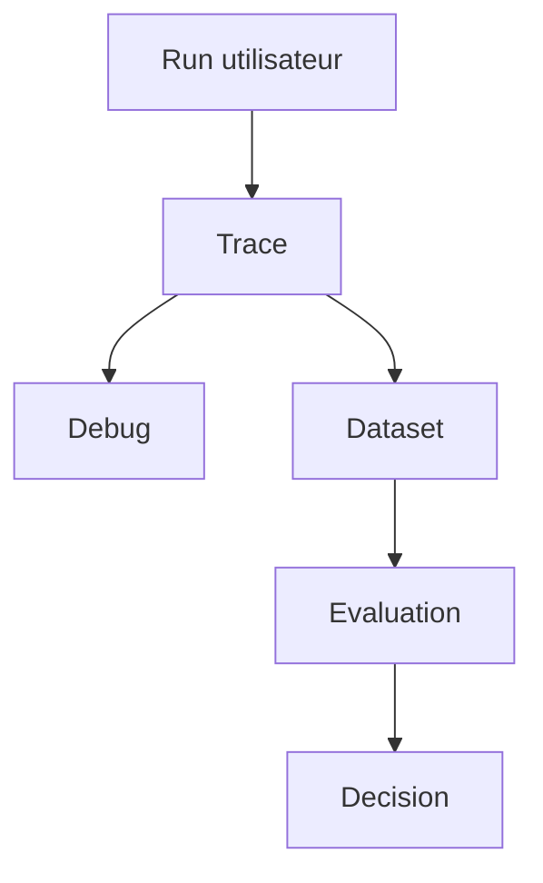

# Module 06 - LangSmith

## Objectifs

A la fin de ce module, vous saurez :

- expliquer le role de LangSmith dans une application LLM ;
- lire une trace pour comprendre ce qui s'est passe pendant un run ;
- construire un dataset d'evaluation avec `inputs`, `outputs` et `metadata` ;
- definir une target function compatible avec `evaluate()` ;
- ecrire des evaluateurs deterministes pour les comportements critiques ;
- distinguer evaluation offline et evaluation online ;
- transformer un echec observe en test de regression ;
- brancher progressivement LangSmith sur un workflow LangGraph.

## 1. Pourquoi LangSmith ?

Les modules precedents construisent un assistant qui sait rechercher des preuves, citer ses
sources, refuser et demander une validation humaine. Mais en production, une question reste :

> Comment savoir ce que le systeme a vraiment fait, et si une nouvelle version est meilleure ?

LangSmith apporte l'observabilite et l'evaluation. Les traces enregistrent les executions. Les
datasets conservent les cas de test. Les evaluateurs notent les sorties. Les experiences
comparent plusieurs versions.



L'objectif n'est pas de regarder des logs par curiosite. L'objectif est de prendre de meilleures
decisions d'architecture.

## 2. Trace, run et projet

Une trace est l'enregistrement structure d'une execution. Dans une application RAG ou agentique,
elle peut contenir :

- la question utilisateur ;
- les appels au retriever ;
- les passages recuperes ;
- les appels modele ;
- les outils appeles ;
- les erreurs ;
- la latence ;
- les sorties finales.

Dans un workflow LangGraph, la trace doit permettre de repondre a des questions simples :

| Question | Signal utile |
|---|---|
| Le bon chemin a-t-il ete pris ? | noeuds executes, routage conditionnel |
| Le retrieval a-t-il trouve les preuves ? | sources, scores, top-k |
| Le systeme a-t-il invente une citation ? | citations resolues par le code |
| Pourquoi une revue humaine a ete demandee ? | `evidence_status`, seuils, topic |
| Quelle version a produit ce run ? | tags, metadata, commit, config |

Une trace utile n'est pas seulement un texte de sortie. Elle montre les decisions intermediaires.

## 3. Dataset LangSmith

Un dataset LangSmith contient des exemples. Chaque exemple a typiquement :

| Champ | Role |
|---|---|
| `inputs` | les entrees donnees a l'application |
| `outputs` | la reference attendue ou les criteres de validation |
| `metadata` | domaine, difficulte, source, split, version |

Exemple adapte au projet d'assurance :

```json
{
  "inputs": {
    "question": "Quelle est la franchise degat des eaux ?"
  },
  "outputs": {
    "answered": true,
    "needs_human_review": false,
    "topic": "coverage",
    "expected_sources": ["home-protection-policy.md"]
  },
  "metadata": {
    "domain": "home_insurance",
    "risk": "standard"
  }
}
```

Un bon dataset ne commence pas avec mille lignes. Il commence avec 5 a 10 cas manuellement
verifies qui representent les comportements critiques : question simple, question hors corpus,
question sensible, mauvaise preuve, refus attendu.

## 4. Target function

Dans LangSmith, l'evaluation lance une target function sur chaque exemple. Cette fonction recoit
les `inputs` du dataset et retourne les sorties de l'application.

```python
def target(inputs: dict) -> dict:
    question = inputs["question"]
    report = run_investigation_workflow(question)
    return {
        "answer": report.answer,
        "answered": report.answered,
        "needs_human_review": report.needs_human_review,
        "topic": report.topic,
        "citations": [citation.model_dump() for citation in report.citations],
    }
```

La target function doit etre stable. Elle ne doit pas changer le format de sortie a chaque
experience, sinon les evaluateurs deviennent fragiles.

## 5. Evaluateurs

Un evaluateur transforme une sortie en score. Dans ce module, on commence par des evaluateurs de
code, car ils sont rapides, gratuits et reproductibles.

| Evaluateur | Ce qu'il mesure |
|---|---|
| `route_accuracy` | reponse, refus ou revue humaine au bon moment |
| `topic_accuracy` | classification de la question |
| `citation_recall` | sources attendues presentes dans les citations |
| `evidence_source_recall` | preuves attendues retrouvees avant decision |
| `audit_contract` | noeuds LangGraph attendus presents dans la trace |
| `answer_contract` | sortie finale conforme au contrat |

Un juge LLM peut etre ajoute ensuite pour noter la fidelite ou la completude. Il ne remplace pas
les evaluateurs de contrat : il les complete.

## 6. Offline vs online

LangSmith distingue deux usages complementaires.

| Type | Moment | Objectif |
|---|---|---|
| Offline evaluation | avant de deployer | comparer versions, prevenir regressions |
| Online evaluation | en production | surveiller qualite, latence, cout, erreurs |

Une bonne boucle de travail ressemble a ceci :

1. un run echoue en production ou en demonstration ;
2. la trace explique le point de rupture ;
3. le cas est ajoute au dataset ;
4. une nouvelle version corrige le probleme ;
5. l'evaluation verifie que les anciens cas ne regressent pas.

## 7. Instrumentation progressive

Pour apprendre proprement, le module utilise trois niveaux :

| Niveau | Outil | Quand l'utiliser |
|---|---|---|
| Local | `audit_trail` + evaluateurs deterministes | CI, apprentissage, exemples sans API |
| SDK LangSmith | `Client`, datasets, `evaluate()` | experimentation partagee |
| Production | tracing + online evaluators | monitoring continu |

Cette progression evite de rendre le cours dependant d'un compte payant. Le comportement central
reste testable localement, puis LangSmith apporte l'interface, le partage et l'historique.

## 8. Application au workflow LangGraph

Le projet 04 evalue le projet 03. Pour chaque question :

1. la target function lance le graphe ;
2. le rapport final est capture ;
3. `audit_trail` est converti en trace locale ;
4. les evaluateurs comparent la sortie a la reference ;
5. un resume d'experience est produit.

Commande principale :

```bash
python projects/04-langsmith-quality-monitoring/app.py evaluate-local
```

Extrait attendu :

```json
{
  "experiment_name": "langgraph-investigation-v1",
  "case_count": 5,
  "passed_cases": 5,
  "pass_rate": 1.0
}
```

## 9. Passage au vrai LangSmith

Quand vous avez un compte LangSmith, installez l'extra :

```bash
pip install -e ".[observability]"
```

Puis synchronisez le dataset :

```bash
python projects/04-langsmith-quality-monitoring/app.py sync-dataset
```

Le SDK officiel permet ensuite de creer un dataset, d'ajouter des exemples et de lancer une
evaluation avec une target function et des evaluateurs. Le cours garde cette partie optionnelle
pour ne jamais publier de cle API.

## Executer les exemples

Trace locale minimale :

```bash
python course/06-langsmith/examples/local_trace_report.py
```

Exporter le dataset au format LangSmith :

```bash
python course/06-langsmith/examples/export_dataset.py
```

Voir le template SDK sans appel reseau :

```bash
python course/06-langsmith/examples/sdk_evaluation_template.py
```

Projet complet :

```bash
python projects/04-langsmith-quality-monitoring/app.py evaluate-local
```

## Limites

- Les traces locales du cours ne remplacent pas l'interface LangSmith.
- Les evaluateurs deterministes ne comprennent pas toute la semantique.
- Les online evaluations demandent une vraie application deployee et du trafic.
- La gestion fine des couts et tokens depend du provider et de l'instrumentation.
- Les Deep Agents arrivent au module 07.

Passez aux [exercices](exercises.md), puis au [quiz](quiz.md).

## References officielles

- [LangSmith Observability](https://docs.langchain.com/langsmith/observability)
- [LangSmith Evaluation](https://docs.langchain.com/langsmith/evaluation)
- [LangSmith Evaluation concepts](https://docs.langchain.com/langsmith/evaluation-concepts)
- [Manage datasets programmatically](https://docs.langchain.com/langsmith/manage-datasets-programmatically)
- [How to evaluate agents](https://docs.langchain.com/langsmith/evaluate-llm-application)
- [Define a target function](https://docs.langchain.com/langsmith/define-target-function)
