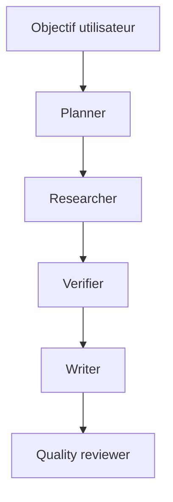

# Module 07 - Deep Agents

> Statut : disponible.

Les modules precedents ont construit les pieces une par une : chaines LangChain, RAG,
workflow LangGraph, validation humaine et evaluation LangSmith. Ce module les assemble dans
une architecture de **Deep Agent** : un agent capable de travailler plus longtemps, de planifier,
de deleguer a des sous-agents, d'utiliser des fichiers comme memoire de travail et de respecter
des permissions explicites.

Le but n'est pas de transformer un LLM en logiciel magique. Le but est de construire un systeme
agentique lisible, auditable, testable et assez discipline pour etre presente dans un portfolio
professionnel.

## Objectifs pedagogiques

A la fin du module, vous saurez :

- expliquer ce qu'un Deep Agent ajoute au-dessus d'un agent simple ;
- decouper un objectif long en taches explicites ;
- deleguer a des sous-agents specialises sans polluer le contexte principal ;
- utiliser un systeme de fichiers comme memoire de travail controlee ;
- modeliser des permissions `allow`, `deny` et `interrupt` ;
- conserver une memoire long terme minimale et des traces exploitables ;
- relier Deep Agents, LangGraph et LangSmith dans une architecture de production.

## Definition pratique

Un Deep Agent est un **harness agentique** : il combine un modele capable d'appeler des outils,
un graphe d'execution, un plan de taches, des sous-agents, un systeme de fichiers, une memoire et
des garde-fous. Dans l'ecosysteme LangChain, le package `deepagents` fournit une fonction
`create_deep_agent` qui s'appuie sur LangGraph et `create_agent`.

Dans ce cours, nous gardons deux niveaux :

| Niveau | Usage | Pourquoi |
|---|---|---|
| Implementation locale | Code deterministe dans `src/ai_course/deep_agents.py` | Tester sans cle API et comprendre les contrats |
| SDK officiel | Template `create_deep_agent` | Savoir passer a un vrai modele tool-calling |

## Architecture cible



Le contexte complet ne remonte pas au noeud principal. Les sous-agents ecrivent les donnees
volumineuses dans des fichiers, puis retournent uniquement un resume exploitable.

## Concepts cles

### 1. Planification

Un objectif long doit devenir une liste de taches courtes, nommees et ordonnees. Une bonne tache
contient :

- un identifiant stable ;
- un proprietaire logique ;
- des dependances ;
- un chemin de sortie ;
- un statut auditable.

Dans le projet, le plan contient cinq etapes :

1. clarification de l'objectif ;
2. retrieval documentaire ;
3. verification des preuves ;
4. redaction du rapport ;
5. quality gate final.

### 2. Sous-agents

Un sous-agent n'est pas seulement un prompt different. C'est un contrat d'execution :

| Sous-agent | Responsabilite | Sortie attendue |
|---|---|---|
| `planner` | Transformer l'objectif en plan | Plan JSON |
| `researcher` | Chercher les preuves | Evidence JSON |
| `verifier` | Choisir la route sure | Decision JSON |
| `writer` | Produire la reponse finale | Rapport Markdown |
| `quality_reviewer` | Verifier les contrats | Gate JSON |

Cette separation reduit la taille du contexte principal et rend les erreurs plus faciles a
diagnostiquer.

### 3. Fichiers comme contexte

Les Deep Agents officiels proposent des outils de fichiers integres comme `ls`, `read_file`,
`write_file`, `edit_file`, `delete`, `glob` et `grep`. Le pattern essentiel est simple :

- les resultats volumineux vont dans des fichiers ;
- le contexte principal ne garde qu'un resume ;
- les fichiers deviennent inspectables, testables et reutilisables.

Dans ce depot, `InMemoryAgentFileSystem` simule ce comportement avec un systeme de fichiers
virtuel afin de rester reproductible en CI.

### 4. Permissions

Une architecture agentique professionnelle doit limiter les actions possibles. Les regles de
permission sont evaluees dans l'ordre : la premiere regle qui matche gagne.

| Mode | Effet |
|---|---|
| `allow` | L'operation continue |
| `deny` | L'operation est bloquee |
| `interrupt` | Une validation humaine est requise |

Le cours bloque par defaut `/secrets/**`, `.env` et tout ce qui n'est pas explicitement autorise.
Les dossiers de travail autorises sont `/workspace/**`, `/reports/**` et `/memories/**`.

### 5. Memoire long terme

La memoire long terme ne doit pas devenir une boite noire. Elle doit stocker des faits stables,
explicites et justifies. Dans le projet, une question liee a la fraude enregistre une regle
durable : les scores de risque ne suffisent pas a prouver une fraude sans validation humaine.

### 6. Skills

Les skills sont des capacites chargeables : instructions, fichiers, outils ou procedures
specialisees. Elles permettent de modulariser les comportements reutilisables au lieu de tout
mettre dans un seul prompt systeme.

### 7. Observabilite

Un Deep Agent doit produire des traces. LangSmith est le bon endroit pour suivre :

- les appels de modele ;
- les outils appeles ;
- les sous-agents invoques ;
- les erreurs ;
- les evaluations offline et online.

Le module 06 fournit deja les briques d'evaluation qui seront reutilisees pour surveiller les
agents plus longs.

## Implementation locale

Le coeur du module est dans :

```text
src/ai_course/deep_agents.py
```

Il fournit :

- `build_investigation_plan` ;
- `build_default_subagents` ;
- `InMemoryAgentFileSystem` ;
- `DeepAgentPolicy` ;
- `LongTermMemory` ;
- `run_deep_investigation_agent` ;
- `evaluate_quality_gate`.

Executer les tests du module :

```bash
pytest tests/test_deep_agents.py
```

## Exemples

Afficher le plan et les sous-agents :

```bash
python course/07-deep-agents/examples/planning_demo.py
```

Observer les permissions :

```bash
python course/07-deep-agents/examples/permissions_demo.py
```

Lancer un Deep Agent local sur un mini-corpus :

```bash
python course/07-deep-agents/examples/local_deep_agent_run.py
```

Afficher un template SDK officiel :

```bash
python course/07-deep-agents/examples/create_deep_agent_template.py
```

## Mini-projet

Le mini-projet du module est :

```text
projects/05-deep-agent-investigation-analyst
```

Il transforme le workflow documentaire en analyste d'investigation :

- planification explicite ;
- sous-agents specialises ;
- fichiers intermediaires ;
- rapport final cite ;
- routage vers revue humaine ;
- memoire long terme ;
- quality gate.

## Passer au SDK officiel

Installer l'extra optionnel :

```bash
pip install -e ".[agents]"
```

Structure minimale :

```python
from deepagents import create_deep_agent

agent = create_deep_agent(
    tools=[search_evidence],
    instructions="Tu analyses uniquement le corpus approuve.",
    subagents=[researcher, verifier, writer],
)

result = agent.invoke({"messages": [{"role": "user", "content": objective}]})
```

Le template complet est volontairement separe dans `examples/create_deep_agent_template.py` afin
de ne pas forcer l'installation du SDK dans les tests offline.

## Checklist professionnelle

Avant de considerer un Deep Agent pret pour un vrai usage, verifiez :

- les permissions de fichiers et d'outils ;
- les routes de revue humaine ;
- la non-publication des citations quand la reponse part en revue ;
- la presence d'un audit trail ;
- les tests de regression ;
- les datasets LangSmith ;
- les couts, la latence et les limites de contexte ;
- les erreurs possibles de chaque outil.

## Erreurs frequentes

- Confondre agent long et prompt plus long.
- Laisser un sous-agent retourner tout son contexte au lieu d'ecrire dans des fichiers.
- Oublier les permissions par defaut.
- Autoriser un agent a lire `.env`.
- Melanger reponse finale et demande de revue humaine.
- Ne pas transformer les incidents en tests.

## References officielles

- [Deep Agents overview](https://docs.langchain.com/oss/python/deepagents/overview)
- [Deep Agents quickstart](https://docs.langchain.com/oss/python/deepagents/quickstart)
- [Customization](https://docs.langchain.com/oss/python/deepagents/customization)
- [Context engineering](https://docs.langchain.com/oss/python/deepagents/context-engineering)
- [Backends](https://docs.langchain.com/oss/python/deepagents/backends)
- [Permissions](https://docs.langchain.com/oss/python/deepagents/permissions)
- [Skills](https://docs.langchain.com/oss/python/deepagents/skills)
