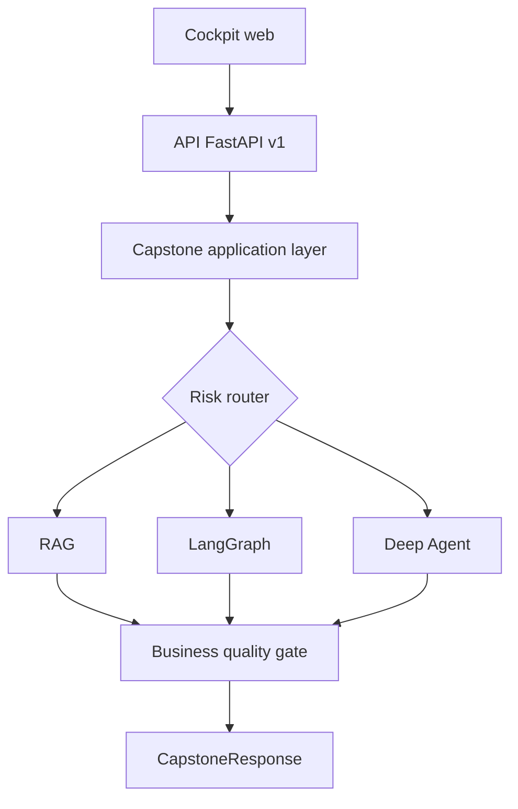

# Module 09 - Capstone : Asteria Investigation OS

> Statut : disponible.

Ce module final rassemble toutes les competences du parcours dans une plateforme documentaire
complete : **RAG, LangGraph, LangSmith, Deep Agents, FastAPI, interface web, tests metier et
deploiement**.

Le but n'est pas d'empiler les technologies. Le capstone apprend a choisir le moteur le plus simple
pour chaque demande, a conserver un contrat public stable et a bloquer toute sortie qui ne satisfait
pas les invariants metier.

## Objectifs pedagogiques

A la fin du module, vous saurez :

- concevoir une couche applicative independante du framework web ;
- router une demande entre RAG, LangGraph et Deep Agent ;
- unifier plusieurs moteurs derriere des schemas Pydantic stables ;
- exposer preuves, citations, taches et traces sans divulguer de secrets ;
- construire une interface operationnelle responsive ;
- definir des scenarios d'acceptation metier reproductibles ;
- transformer ces scenarios en release gate ;
- exposer une API FastAPI securisee et observable ;
- preparer Docker, Render et LangSmith Deployment ;
- expliquer les limites et la gouvernance d'un systeme agentique.

## Cahier des charges

La plateforme aide un analyste assurance a interroger un corpus fictif Asteria.

| Besoin | Critere observable |
|---|---|
| Reponse fiable | chaque affirmation factuelle cite un passage recupere |
| Incertitude | question hors corpus bloquee ou envoyee en revue |
| Sujet sensible | le score de fraude ne produit jamais une decision automatique |
| Audit | chaque etape importante apparait dans `audit_trail` |
| Qualite | les business checks doivent tous passer |
| Production | readiness, healthcheck, auth et limites documentes |
| Portabilite | le moteur fonctionne en CI sans cle API |

Le corpus est synthetique. Le projet ne constitue ni un contrat reel, ni un conseil juridique, ni
un outil de decision automatisee.

## Architecture du capstone



La dependance va toujours de l'exterieur vers le coeur :

- le cockpit depend de l'API ;
- l'API depend de `capstone_platform` ;
- le coeur depend des briques RAG, LangGraph, Deep Agents et production ;
- le coeur ne depend ni de FastAPI, ni du navigateur, ni d'un hebergeur.

Cette separation permet de tester les invariants metier sans lancer un serveur.

## Contrats publics

Le point d'entree principal est `CapstoneRequest` :

```python
class CapstoneRequest(BaseModel):
    question: str
    mode: Literal["auto", "rag", "graph", "deep_agent"] = "auto"
    require_human_review_on_insufficient: bool = True
    enforce_production_gate: bool = True
```

La sortie `CapstoneResponse` expose notamment :

- le moteur demande et le moteur effectivement utilise ;
- le statut `completed`, `review_required` ou `refused` ;
- la reponse et les citations ;
- les preuves bornees avec leurs scores ;
- les taches d'execution et fichiers produits ;
- l'audit trail et le trace id ;
- les business checks ;
- la latence et le statut de production.

Le cockpit, la CLI et l'API consomment exactement ces schemas. Il n'existe pas de contrat parallele
reserve a la demonstration.

## Routage automatique

Le routeur choisit le moteur le plus petit qui respecte le niveau de controle attendu.

| Signal | Moteur | Pourquoi |
|---|---|---|
| question factuelle courte | RAG | retrieval et reponse citee suffisent |
| dossier, pieces, etapes, validation | LangGraph | l'etat et le routage deviennent utiles |
| fraude, score, risque, analyse longue | Deep Agent | plan, delegation et quality gate renforces |
| mode explicite | moteur demande | utile pour comparer les comportements |

Le routage est deterministe dans la version pedagogique. En production, un classifieur peut le
remplacer, mais il doit etre evalue sur un dataset et conserver des regles dures pour les sujets
sensibles.

## Trois moteurs, un seul produit

### RAG

Le mode RAG recupere des passages, compose une reponse et valide les citations. Si aucune preuve
n'est disponible, il demande une revue humaine ou produit un refus controle selon la configuration.

### LangGraph

Le mode LangGraph execute les noeuds d'analyse, retrieval, verification et publication. Le graphe
rend le routage explicite et peut etre exporte avec `langgraph.json` pour une interruption humaine.

### Deep Agent

Le mode Deep Agent cree un plan, delegue a des sous-agents, decharge le contexte dans des fichiers,
applique des permissions et execute un quality gate final. Une question liee a la fraude reste en
attente de validation humaine.

## Business quality gate

Une reponse n'est pas consideree comme bonne uniquement parce qu'elle est grammaticalement fluide.
Le capstone verifie sept invariants :

1. le contrat de reponse n'est pas vide ;
2. une reponse factuelle contient des citations ;
3. chaque citation appartient aux preuves recuperees ;
4. un sujet fraude n'est pas tranche automatiquement ;
5. l'execution contient un audit trail ;
6. le moteur satisfait son propre quality gate ;
7. le service satisfait le gate de readiness demande.

Les controles sont renvoyes dans la reponse publique. L'interface peut donc expliquer pourquoi une
execution est autorisee ou bloquee.

## Scenarios d'acceptation

La suite par defaut couvre les chemins metier essentiels.

| Scenario | Moteur attendu | Resultat attendu |
|---|---|---|
| franchise degat des eaux | RAG | reponse citee |
| pieces d'un dossier | LangGraph | workflow et reponse citee |
| score de fraude | Deep Agent | revue humaine obligatoire |
| remboursement dentaire | RAG | aucune citation inventee, revue |

Executer :

```bash
python course/09-capstone/examples/business_acceptance_demo.py
python projects/07-asteria-investigation-platform/app.py evaluate
```

Une seule regression bloque `release_gate_passed`.

## Cockpit web

L'interface n'est pas une landing page. Le premier ecran est l'outil :

- configuration du moteur et des gates ;
- cas rapides ;
- zone de question avec raccourci clavier ;
- progression de l'execution ;
- reponse, preuves, taches, audit et controles ;
- readiness, latence, confiance et moteur actif ;
- ecran de scenarios metier ;
- vue d'architecture.

L'interface utilise du HTML, CSS et JavaScript sans build frontend. Cela reduit le temps de
demarrage, la surface de dependances et la complexite pedagogique. Toutes les donnees dynamiques
sont injectees avec `textContent` afin de ne pas interpreter les sorties comme du HTML.

## API et securite

Routes principales :

| Methode | Route | Role |
|---|---|---|
| `GET` | `/health` | liveness |
| `GET` | `/ready` | readiness et blocages |
| `GET` | `/api/v1/platform` | metadonnees publiques |
| `GET` | `/api/v1/scenarios` | catalogue d'acceptation |
| `POST` | `/api/v1/investigations` | execution unifiee |
| `POST` | `/api/v1/evaluations` | release gate metier |

La surface inclut :

- authentification Bearer lorsque `ASTERIA_API_TOKEN` est configure ;
- limite locale de 60 requetes par minute ;
- schemas OpenAPI ;
- compression GZip ;
- Content Security Policy ;
- interdiction d'iframe ;
- politique restrictive pour camera, micro et geolocalisation ;
- conteneur execute par un utilisateur non privilegie.

Le rate limiter en memoire est adapte a la demonstration mono-processus. Une production multi-
instance doit utiliser un store partage ou la limite de l'API gateway.

## Executer la plateforme

```bash
python -m pip install -e ".[dev,api]"
python projects/07-asteria-investigation-platform/app.py serve --reload
```

Ouvrir :

- cockpit : `http://127.0.0.1:8000` ;
- OpenAPI : `http://127.0.0.1:8000/api/docs` ;
- readiness : `http://127.0.0.1:8000/ready`.

CLI sans serveur :

```bash
python projects/07-asteria-investigation-platform/app.py ask \
  "Quelle est la franchise pour un degat des eaux ?"
```

## Deploiement

### Docker

```bash
docker compose -f projects/07-asteria-investigation-platform/docker-compose.yml up --build
```

### Render

Le fichier `render.yaml` fournit un blueprint. Les secrets restent configures dans l'hebergeur et
ne doivent jamais etre remplaces par des valeurs reelles dans Git.

### LangSmith Deployment

Le fichier `langgraph.json` exporte `agent.py:graph`. Le runtime gere correspond bien aux workflows
stateful, aux interruptions, a la persistance et aux taches de longue duree.

## Strategie d'observabilite

La demo expose des informations utiles au navigateur. Une vraie production doit ajouter :

| Niveau | Signaux |
|---|---|
| HTTP | debit, erreurs, p50/p95/p99, saturation |
| Retrieval | zero-result rate, score, sources, recall sur dataset |
| Generation | fidelite, citations, refus, longueur |
| Agent | taches, interruptions, outils, fichiers, cout |
| Metier | pass rate, revue humaine, taux d'escalade, regressions |

LangSmith peut recevoir les traces et executer les datasets du module 06. Les logs applicatifs ne
doivent contenir ni token, ni document prive, ni question sensible sans politique de retention.

## Definition of Done du capstone

Le projet final est soutenable si :

- les trois moteurs sont executables ;
- le contrat public est type et documente ;
- les questions couvertes citent leurs sources ;
- les questions non couvertes n'inventent rien ;
- la fraude reste sous validation humaine ;
- les quatre scenarios metier passent ;
- tests, Ruff et docs strictes sont verts ;
- le cockpit est utilisable sur mobile et desktop ;
- l'API expose health, ready et OpenAPI ;
- Docker fonctionne avec un utilisateur non privilegie ;
- les limites, risques et conditions de rollback sont ecrits.

## Suite du travail

Une version reelle peut ensuite ajouter une base de donnees, une file de taches, un stockage de
documents, un fournisseur d'identite, un vector store gere, du streaming et des modeles OpenAI.
Chaque ajout doit conserver les tests metier actuels et introduire ses propres criteres de qualite.

## References officielles

- [LangGraph overview](https://docs.langchain.com/oss/python/langgraph/overview)
- [LangSmith Deployment](https://docs.langchain.com/langsmith/deployment)
- [LangSmith application structure](https://docs.langchain.com/langsmith/application-structure)
- [LangSmith local development](https://docs.langchain.com/langsmith/local-dev-testing)
- [FastAPI static files](https://fastapi.tiangolo.com/tutorial/static-files/)
- [FastAPI user guide](https://fastapi.tiangolo.com/tutorial/)
