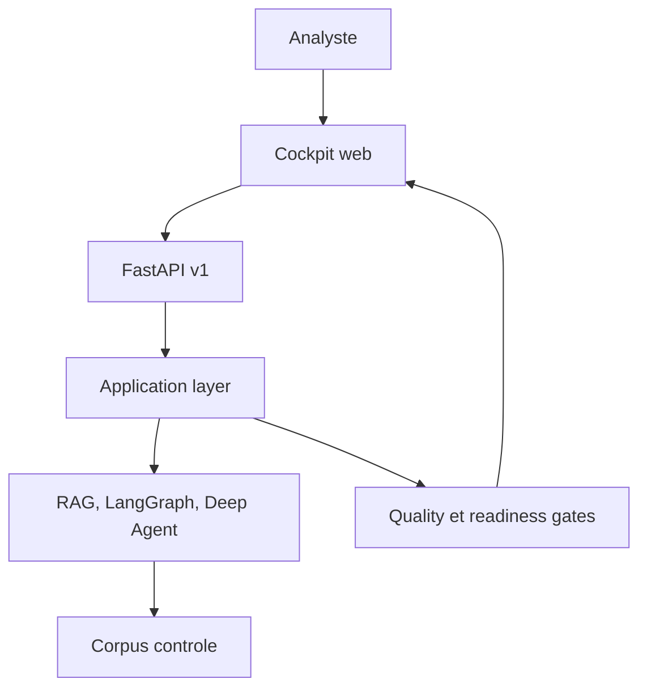
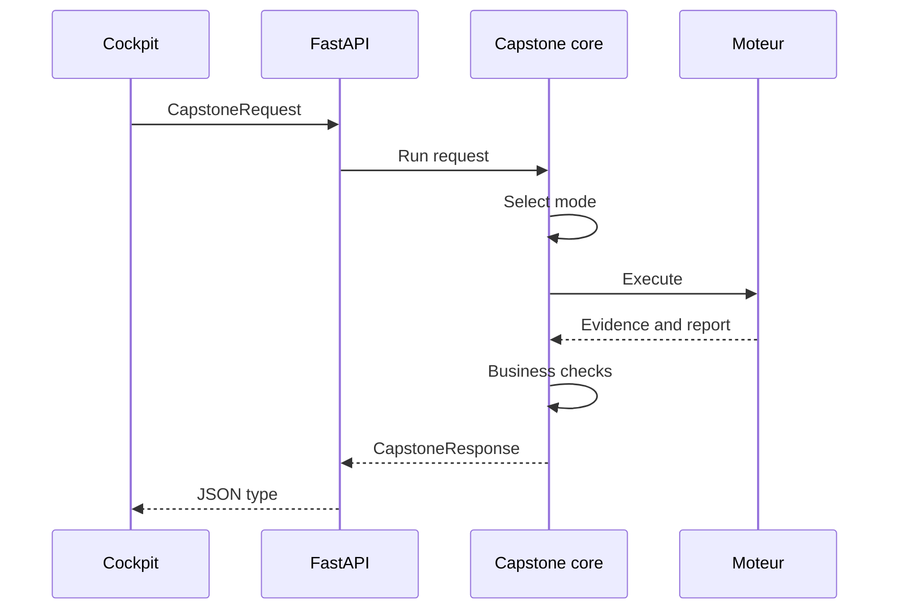

# Architecture du capstone

Cette page decrit l'architecture de **Asteria Investigation OS**, le projet final du parcours. Elle
complete le code avec les decisions, frontieres et risques necessaires a une revue professionnelle.

## Vue systeme

## Frontieres

| Couche | Responsabilite | Ne doit pas faire |
|---|---|---|
| Frontend | interaction, etats, visualisation | inventer des regles metier |
| API | HTTP, auth, rate limit, schemas | contenir l'orchestration principale |
| Application | routage, contrats, quality gates | dependre de FastAPI |
| Moteurs | retrieval, graphes, agents | publier directement une reponse HTTP |
| Operations | readiness, probes, deploiement | modifier une decision metier |

## Flux d'une investigation

## Decisions d'architecture

### ADR-001 - Coeur deterministe

Le capstone doit fonctionner sans cle API. Les demonstrations et la CI restent reproductibles, puis
les integrations reelles peuvent remplacer les composants locaux derriere les memes protocoles.

### ADR-002 - Contrat unique

La CLI, l'API et le cockpit utilisent `CapstoneRequest` et `CapstoneResponse`. Cette decision evite
les divergences entre une demo visuelle et le produit teste.

### ADR-003 - Routage explicite

Le mode `auto` repose sur des signaux deterministes. Il est facile a expliquer, tester et auditer.
Un classifieur probabiliste futur devra etre mesure avant de remplacer ce routeur.

### ADR-004 - Frontend sans build

Le cockpit utilise HTML, CSS et JavaScript natifs. Le projet garde un demarrage rapide et evite de
transformer le cours IA en cours de bundler. Le compromis est une architecture frontend moins
modulaire qu'une grande application TypeScript.

### ADR-005 - Validation humaine sur la fraude

Le score sert a prioriser. Il ne constitue jamais une preuve suffisante pour une conclusion de
fraude ou un refus. Le quality gate verifie cet invariant independamment du moteur.

## Modele de menace simplifie

| Menace | Protection actuelle | Extension production |
|---|---|---|
| sortie HTML malveillante | rendu avec `textContent`, CSP | sanitation centralisee |
| appel API non autorise | Bearer token optionnel | OIDC, roles et rotation |
| abus de debit | limite mono-processus | gateway ou store partage |
| fuite de secret | `.env` ignore, filtre de payload | secret manager et DLP |
| citation inventee | comparaison aux preuves | evaluation continue |
| decision sensible | revue humaine | workflow d'approbation durable |
| perte d'etat | audit dans la reponse | base, queue et retention |

## Evolutivite

La prochaine architecture peut remplacer `StaticEvidenceStore` par un vector store, envoyer les
traces a LangSmith, persister les threads LangGraph et executer les agents sur Agent Server. Les
contrats publics et les scenarios metier doivent rester inchanges pendant cette migration.
