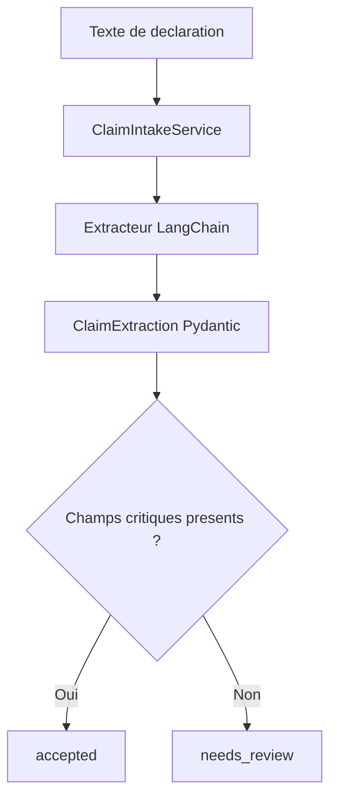

# Insurance Claim Intake

Mini-projet du module 02 : transformer une declaration d'assurance non structuree en objet valide et exploitable.

## Fonctionnalites

- extraction structuree avec LangChain et Pydantic ;
- validation des types et de la coherence des champs manquants ;
- statut `accepted` ou `needs_review` ;
- timeout par tentative ;
- retries limites avec backoff exponentiel ;
- aucune relance automatique des erreurs de validation ;
- donnees de demonstration entierement synthetiques ;
- tests sans appel API.

## Architecture



Le service depend d'un protocole `AsyncClaimExtractor`, et non d'une classe concrete. Le modele reel peut donc etre remplace par un fake pendant les tests.

## Installation

Depuis la racine du depot :

```bash
python -m venv .venv
source .venv/bin/activate
pip install -e ".[dev]"
cp .env.example .env
```

Ajoutez votre cle API dans `.env`, sans jamais publier ce fichier.

## Lancer une declaration

```bash
python projects/01-insurance-claim-intake/run.py \
  "La demande CLM-123456 concerne un degat des eaux du 14 aout 2026 pour 1250 euros."
```

Options de resilience :

```bash
python projects/01-insurance-claim-intake/run.py \
  --timeout 20 \
  --max-attempts 3 \
  "Texte de la declaration contenant suffisamment d'informations."
```

## Exemple de sortie

```json
{
  "status": "accepted",
  "claim": {
    "claim_id": "CLM-123456",
    "incident_date": "2026-08-14",
    "amount_eur": 1250.0,
    "category": "water_damage",
    "summary": "Degat des eaux dans la cuisine.",
    "missing_fields": [],
    "requires_human_review": false
  },
  "attempts": 1,
  "warning": null
}
```

## Politique d'erreur

| Erreur | Strategie |
|---|---|
| Timeout | Retry limite |
| Connexion temporaire | Retry limite |
| Validation Pydantic | Echec immediat |
| Texte trop court | Echec immediat |
| Type de retour incorrect | Echec immediat |
| Tentatives epuisees | `ExtractionUnavailableError` |

Le CLI desactive les retries internes du fournisseur afin que la politique du service reste la seule couche de retry. Empiler plusieurs politiques peut multiplier les appels, la latence et le cout.

## Limites

- le projet ne verifie pas encore la declaration contre un contrat ;
- il ne stocke aucune donnee dans une base ;
- il n'inclut pas encore d'authentification ni d'API web ;
- le schema valide la structure, pas la veracite de l'extraction ;
- une revue humaine reste obligatoire lorsque des informations critiques manquent.

Ces limites seront traitees dans les modules RAG, LangGraph, LangSmith et production.

