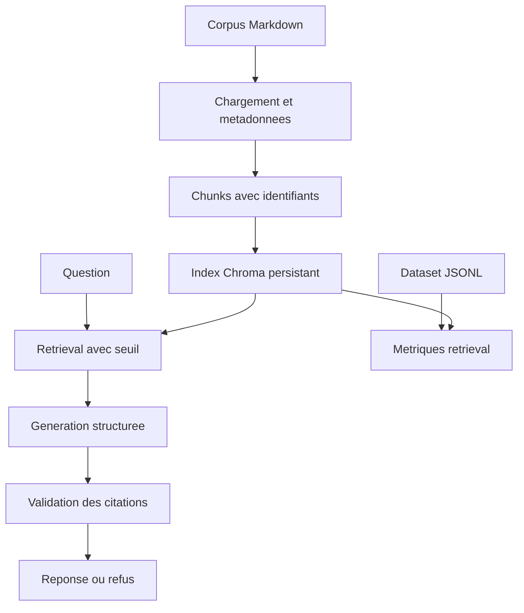

# Documentary RAG Assistant

Assistant documentaire RAG pour interroger un corpus fictif d'assurance, retrouver les
preuves utiles et produire une reponse dont chaque citation est verifiee par l'application.

Ce mini-projet transforme les primitives du module 03 en un systeme reproductible : plusieurs
documents, index vectoriel persistant, manifeste auditable, CLI et evaluation du retrieval.

> Toutes les regles, marques et donnees du corpus sont fictives. Le projet est pedagogique et
> ne fournit aucune decision d'assurance ni conseil juridique.

## Fonctionnalites

- ingestion recursive de fichiers Markdown et texte en UTF-8 ;
- metadonnees de provenance et empreinte SHA-256 pour chaque source ;
- chunking reproductible avec identifiants stables ;
- index Chroma persistant et versionne par configuration ;
- verification du modele d'embedding lors de la reouverture ;
- recherche seule, sans appel a un chat model ;
- generation structuree limitee aux preuves retrouvees ;
- refus deterministe lorsqu'aucun contexte ne depasse le seuil ;
- rejet des citations inventees ou absentes du retrieval ;
- dataset JSONL et evaluation Hit Rate@k, Recall@k et MRR ;
- embeddings locaux deterministes pour les tests et la demonstration gratuite.

## Architecture



La separation des composants permet de distinguer deux echecs souvent confondus :

1. le bon passage n'a jamais ete retrouve ;
2. le passage etait present, mais la generation l'a mal utilise.

## Structure

| Element | Role |
|---|---|
| `data/` | Corpus fictif multi-documents |
| `evaluation/questions.jsonl` | Questions, sources attendues et reponses de reference |
| `app.py index` | Construction de l'index persistant et du manifeste |
| `app.py search` | Inspection des chunks retrouves et de leurs scores |
| `app.py ask` | Reponse LLM avec citations applicativement verifiees |
| `app.py evaluate` | Mesures deterministes de la qualite du retrieval |
| `.local/chroma/manifest.json` | Provenance, configuration et revision de l'index |

Le dossier `.local/` est volontairement ignore par Git : un index est un artefact reconstruit
a partir du corpus, pas une source a versionner.

## Installation

Depuis la racine du depot :

```bash
python -m venv .venv
source .venv/bin/activate
python -m pip install --upgrade pip
pip install -e ".[dev,rag]"
cp .env.example .env
```

Sous Windows, activez l'environnement avec `.venv\\Scripts\\activate`.

## Demarrage sans cle API

Les embeddings de hashing rendent le pipeline entierement local et reproductible. Ils sont
utiles pour apprendre, tester l'architecture et executer la CI, mais ne remplacent pas un vrai
modele semantique.

```bash
python projects/02-documentary-rag-assistant/app.py index --offline

python projects/02-documentary-rag-assistant/app.py search \
  "Un score eleve prouve-t-il une fraude ?"

python projects/02-documentary-rag-assistant/app.py evaluate \
  --k 4 \
  --min-score 0.2
```

## Utilisation avec OpenAI

Renseignez `OPENAI_API_KEY` dans `.env`, puis construisez un index semantique :

```bash
python projects/02-documentary-rag-assistant/app.py index
```

L'index memorise le fournisseur et le modele d'embedding. Une requete ne peut donc pas ouvrir
accidentellement l'index avec un autre espace vectoriel.

```bash
python projects/02-documentary-rag-assistant/app.py ask \
  "Quels justificatifs fournir apres un vol ?"
```

Exemple de contrat de sortie :

```json
{
  "answer": "Le dossier doit contenir le depot de plainte, la liste des biens et les preuves de possession.",
  "answered": true,
  "citations": [
    {
      "chunk_id": "claim-handling-procedure.md#chunk-000",
      "source": "claim-handling-procedure.md"
    }
  ],
  "retrieved_chunks": 3
}
```

Le texte exact varie avec le modele. Le schema, la presence d'une citation valide et les
garde-fous restent controles par le code.

## Evaluation du retrieval

Le dataset contient des questions repondables et des questions hors corpus. Les metriques ne
font aucun appel LLM : elles comparent les sources retrouvees aux sources attendues.

| Metrique | Question mesuree |
|---|---|
| Hit Rate@k | Au moins une source attendue apparait-elle dans le top-k ? |
| Source Recall@k | Quelle proportion des sources attendues est retrouvee ? |
| MRR | A quel rang apparait la premiere source pertinente ? |
| Empty retrieval rate | A titre diagnostique, quelle part des questions hors corpus ne retourne rien ? |

Un score global ne suffit pas. Le rapport conserve le resultat de chaque question pour rendre
les regressions analysables. Le taux de retrieval vide n'est pas une mesure de correction : un
retriever peut retourner un passage proche mais insuffisant. La decision de refuser appartient au
pipeline de generation et doit etre evaluee separement.

## Choix d'architecture

### Pourquoi un manifeste ?

Le dossier Chroma seul ne dit pas clairement quel corpus, quel chunking ou quel modele a produit
les vecteurs. Le manifeste enregistre ces informations et bloque les configurations incompatibles.

### Pourquoi versionner la collection ?

La revision depend du corpus, du modele d'embedding et des parametres de chunking. Deux
configurations ne partagent donc pas silencieusement la meme collection.

### Pourquoi valider les citations dans le code ?

Le LLM propose des `chunk_id`, mais seule l'application connait les chunks effectivement
retrouves. Une source inventee provoque une erreur au lieu d'etre affichee comme preuve.

## Limites connues

- le corpus de demonstration contient uniquement des fichiers Markdown et texte ;
- les embeddings de hashing sont lexicaux et non semantiques ;
- le seuil doit etre calibre pour chaque modele et chaque corpus ;
- Chroma local convient a un prototype, pas a toutes les contraintes distribuees ;
- l'evaluation actuelle mesure le retrieval, pas encore la fidelite de la generation ;
- l'authentification, les droits documentaires et les donnees personnelles arrivent en production.

L'evaluation de la correction, de la fidelite et de la completude de la reponse sera ajoutee au
module 04. Les traces et datasets geres arriveront avec LangSmith au module 06.

## References officielles

- [LangChain - Chroma](https://docs.langchain.com/oss/python/integrations/vectorstores/chroma)
- [LangChain - Document loaders](https://docs.langchain.com/oss/python/integrations/document_loaders)
- [LangSmith - Evaluate a RAG application](https://docs.langchain.com/langsmith/evaluate-rag-tutorial)
- [LangSmith - Evaluation concepts](https://docs.langchain.com/langsmith/evaluation-concepts)
