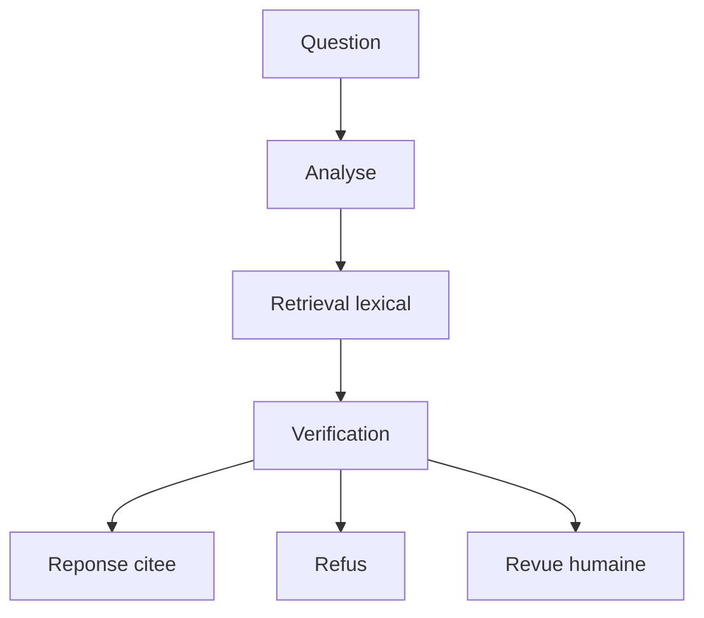

# LangGraph Investigation Workflow

Workflow LangGraph qui orchestre une question documentaire selon un chemin controlable :

```text
analyze_question -> retrieve_evidence -> verify_evidence -> answer/refusal/human_review
```

Ce projet transforme le RAG documentaire en workflow stateful. Il ne cherche pas encore a creer
un agent autonome : l'objectif est de rendre les transitions critiques explicites, testables et
auditables.

## Fonctionnalites

- etat partage type avec `InvestigationState` ;
- noeuds separes pour analyse, retrieval, verification, reponse et revue humaine ;
- routage conditionnel selon les preuves et le niveau de risque ;
- `audit_trail` append-only pour tracer le chemin execute ;
- politique de seuils configurable ;
- support pedagogique de `interrupt()` et `Command(resume=...)` ;
- CLI locale sans cle API.

## Architecture



Le projet reutilise le corpus synthetique de `projects/02-documentary-rag-assistant/data`.
Le retriever lexical est volontairement simple : ce projet enseigne LangGraph, pas l'optimisation
du retrieval semantique.

## Utilisation

Depuis la racine du depot :

```bash
python projects/03-langgraph-investigation-workflow/app.py \
  "Quelle est la franchise degat des eaux ?"
```

Question sensible avec revue humaine probable :

```bash
python projects/03-langgraph-investigation-workflow/app.py \
  "Le modele peut-il refuser l'indemnisation ?" \
  --review-score 0.9
```

Simuler une validation humaine :

```bash
python projects/03-langgraph-investigation-workflow/app.py \
  "Le modele peut-il refuser l'indemnisation ?" \
  --review-score 0.9 \
  --approve \
  --review-note "Validation humaine pedagogique" \
  --replacement-answer "Non, un score sert a prioriser et ne prouve pas une fraude."
```

Refuser directement lorsqu'aucune preuve n'est trouvee :

```bash
python projects/03-langgraph-investigation-workflow/app.py \
  "Quel remboursement existe pour une couronne dentaire ?" \
  --no-human-review-on-missing
```

## Contrat de sortie

```json
{
  "question": "Quelle est la franchise degat des eaux ?",
  "answer": "Les preuves retrouvees indiquent : La franchise contractuelle est fixee a 180 euros par sinistre.",
  "answered": true,
  "needs_human_review": false,
  "topic": "coverage",
  "evidence_status": "sufficient",
  "evidence_count": 1,
  "citations": [
    {
      "chunk_id": "home-protection-policy.md#chunk-000",
      "source": "home-protection-policy.md"
    }
  ],
  "audit_trail": [
    "analyze_question",
    "retrieve_evidence:1",
    "verify_evidence:sufficient",
    "draft_answer"
  ],
  "human_notes": null
}
```

## Pourquoi c'est important

Un systeme documentaire en assurance ne doit pas seulement produire une reponse plausible. Il doit
expliquer le chemin suivi, savoir refuser, demander une validation lorsque les preuves sont faibles
et conserver assez d'etat pour etre audite.

LangGraph rend ce comportement explicite.

## Limites

- retrieval lexical local, non semantique ;
- pas encore de traces LangSmith ;
- checkpointer persistant reserve aux modules suivants ;
- aucune authentification ni gestion de droits documentaires ;
- donnees entierement fictives.

## References officielles

- [LangGraph - Overview](https://docs.langchain.com/oss/python/langgraph/overview)
- [LangGraph - Graph API](https://docs.langchain.com/oss/python/langgraph/graph-api)
- [LangGraph - Interrupts](https://docs.langchain.com/oss/python/langgraph/interrupts)
- [LangGraph - Persistence](https://docs.langchain.com/oss/python/langgraph/persistence)
