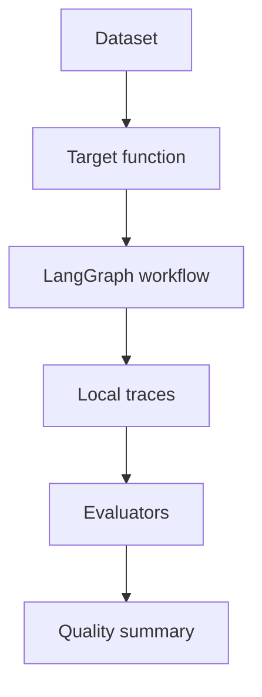

# LangSmith Quality Monitoring

Projet de qualite pour le workflow d'investigation documentaire. Il transforme le projet
LangGraph en cible d'evaluation : chaque question du dataset devient un run, chaque `audit_trail`
devient une trace locale, puis des evaluateurs deterministes mesurent la route suivie, les
citations, les preuves et le contrat de sortie.

Le projet est volontairement executable sans cle API. La synchronisation vers LangSmith reste
optionnelle pour reproduire le meme dataset dans l'interface officielle.

## Fonctionnalites

- dataset JSONL compatible avec le vocabulaire LangSmith : `inputs`, `outputs`, `metadata` ;
- cible d'evaluation construite autour du workflow LangGraph du projet 03 ;
- traces locales derivees de `audit_trail` ;
- evaluateurs de route, topic, citation recall, evidence recall et contrat de reponse ;
- export JSONL pret pour `Client.create_examples` ;
- commande optionnelle de synchronisation avec le SDK LangSmith.

## Architecture



## Utilisation locale

Depuis la racine du depot :

```bash
python projects/04-langsmith-quality-monitoring/app.py evaluate-local
```

La sortie resume les scores principaux :

- `route_accuracy` : le workflow repond, refuse ou demande une revue au bon moment ;
- `topic_accuracy` : la question est classee dans le bon domaine ;
- `citation_recall` : les sources attendues sont citees lorsque le systeme repond ;
- `evidence_source_recall` : les preuves attendues sont retrouvees, meme si la reponse est bloquee ;
- `audit_contract` : le graphe a execute les noeuds attendus ;
- `answer_contract` : la sortie respecte le contrat utilisateur.

Sauvegarder une experience complete :

```bash
python projects/04-langsmith-quality-monitoring/app.py evaluate-local \
  --output projects/04-langsmith-quality-monitoring/.local/experiment.json
```

## Exporter le dataset

```bash
python projects/04-langsmith-quality-monitoring/app.py export-dataset
```

Le fichier genere reprend le format accepte par la creation d'exemples LangSmith :

```json
{
  "inputs": {"question": "Quelle est la franchise degat des eaux ?"},
  "outputs": {
    "answered": true,
    "needs_human_review": false,
    "topic": "coverage"
  },
  "metadata": {
    "example_id": "coverage-water-deductible",
    "split": "validation"
  }
}
```

## Synchronisation LangSmith optionnelle

Installer l'extra observability :

```bash
pip install -e ".[observability]"
```

Configurer les variables d'environnement LangSmith, puis lancer :

```bash
python projects/04-langsmith-quality-monitoring/app.py sync-dataset
```

Cette commande cree un dataset dans LangSmith avec les exemples du projet. Elle n'est pas
executee en CI, car elle depend d'un compte et d'une cle API.

## Pourquoi ce projet compte

Un assistant documentaire ne devient pas fiable parce qu'il repond bien a trois demonstrations.
Il devient defendable quand ses cas importants sont versionnes, quand chaque regression est
visible, et quand une trace permet de comprendre si l'erreur vient du retrieval, du routage, de
la generation ou de la validation humaine.

## Limites

- les traces locales ne remplacent pas les traces completes LangSmith ;
- le dataset est petit pour rester lisible dans un cours ;
- les evaluateurs sont deterministes et ne jugent pas toute la qualite semantique ;
- les metriques de cout, tokens et latence provider arrivent avec une vraie instrumentation.

## References officielles

- [LangSmith Observability](https://docs.langchain.com/langsmith/observability)
- [LangSmith Evaluation](https://docs.langchain.com/langsmith/evaluation)
- [Create and manage datasets programmatically](https://docs.langchain.com/langsmith/manage-datasets-programmatically)
- [How to evaluate agents](https://docs.langchain.com/langsmith/evaluate-llm-application)
