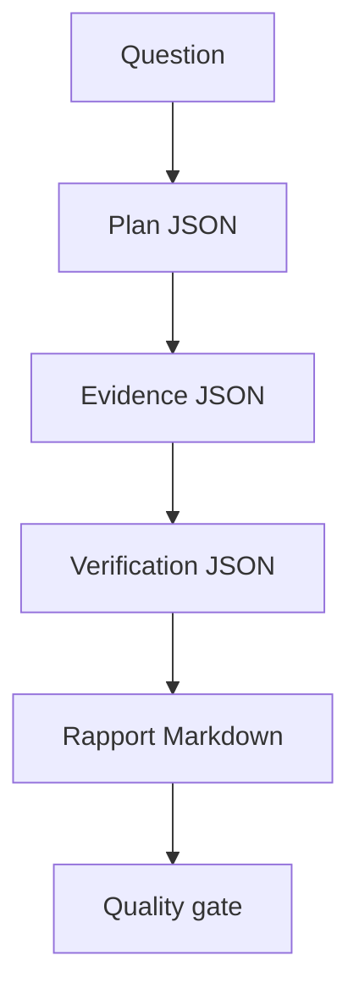

# Project 05 - Deep Agent Investigation Analyst

Ce projet transforme le workflow documentaire du cours en analyste Deep Agent local. Il planifie
la demande, delegue la recherche, verifie les preuves, redige un rapport et applique un quality
gate avant de retourner la sortie.

Le projet est volontairement executable sans cle API. Il sert de reference propre pour comprendre
les contrats Deep Agents avant de brancher un modele tool-calling et le SDK officiel.

## Ce que le projet demontre

- planification explicite des taches ;
- sous-agents `planner`, `researcher`, `verifier`, `writer` et `quality_reviewer` ;
- fichiers intermediaires virtuels ;
- permissions de lecture/ecriture ;
- routage vers revue humaine ;
- memoire long terme minimale ;
- rapport final auditable ;
- tests deterministes.

## Architecture



## Lancer le projet

Depuis la racine du depot :

```bash
python projects/05-deep-agent-investigation-analyst/app.py \
  "Quelle est la franchise degat des eaux ?"
```

Question sensible :

```bash
python projects/05-deep-agent-investigation-analyst/app.py \
  "Un score de risque prouve-t-il une fraude ?"
```

Question non couverte :

```bash
python projects/05-deep-agent-investigation-analyst/app.py \
  "Quel remboursement existe pour une couronne dentaire ?"
```

## Options utiles

```bash
python projects/05-deep-agent-investigation-analyst/app.py \
  "Quel est le delai pour declarer un vol ?" \
  --k 2 \
  --min-score 0.2 \
  --review-score 0.9
```

| Option | Role |
|---|---|
| `--corpus` | Chemin vers le corpus Markdown/text |
| `--k` | Nombre maximum de preuves |
| `--min-score` | Score lexical minimal |
| `--review-score` | Seuil de confiance pour les questions sensibles |
| `--no-human-review-on-missing` | Refuser directement si les preuves manquent |

## Contrats de sortie

La CLI imprime un objet JSON `DeepAgentRunReport` :

- `answer` : reponse finale ou demande de revue ;
- `answered` : vrai uniquement si l'agent peut publier ;
- `needs_human_review` : vrai si une validation humaine est necessaire ;
- `citations` : sources publiees uniquement quand la reponse est publiable ;
- `tasks` : plan et statuts ;
- `files` : fichiers virtuels produits ;
- `quality_gate` : checks finaux.

## Tests

```bash
pytest tests/test_deep_agents.py
```

## Passage au vrai SDK

Le passage au package `deepagents` consiste a remplacer les fonctions deterministes par de vrais
outils LangChain, puis a creer l'agent avec `create_deep_agent`. Le template est dans :

```bash
python course/07-deep-agents/examples/create_deep_agent_template.py
```

Gardez les memes contrats : permissions, fichiers, sous-agents, citations, revue humaine et
observabilite LangSmith.
