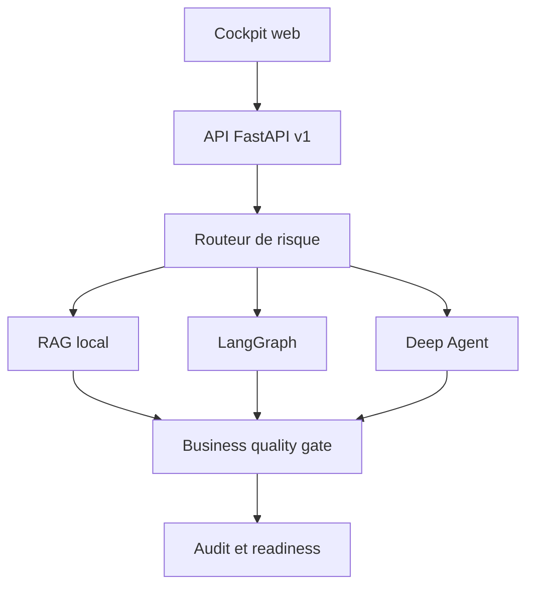

# AtlasDocAI

Plateforme capstone du cours **De LangChain aux Deep Agents**. Elle rassemble une interface web,
une API FastAPI versionnee, un moteur RAG, un workflow LangGraph, un Deep Agent, des citations,
des garde-fous humains, un journal d'audit et une suite de tests metier.

Le corpus et les decisions sont fictifs. La plateforme aide a structurer une investigation ;
elle ne prend jamais seule une decision de fraude ou d'indemnisation.

Anciennement Asteria Investigation OS. Le chemin `projects/07-asteria-investigation-platform`,
les variables `ASTERIA_*`, la cle de session du jeton, les identifiants Docker et LangGraph restent
inchanges pour preserver les installations existantes. Le nom public est desormais AtlasDocAI,
y compris dans l'API, la CLI et les rapports telecharges.

## Demarrage local

```bash
python -m pip install -e ".[dev,api]"
python projects/07-asteria-investigation-platform/app.py serve --reload
```

Ouvrir ensuite `http://127.0.0.1:8000`. La documentation OpenAPI est disponible sur
`http://127.0.0.1:8000/api/docs`.

## Interface web

L'interface adaptative privilegie la question, la reponse et les sources. Elle ne necessite ni Node.js,
ni compilation frontend, ni CDN : HTML, CSS, JavaScript, police et icones sont servis par FastAPI.

| Espace | Fonctions |
|---|---|
| Assistant | Question, exemples metier, choix du moteur, reglages avances, sources consultables |
| Resultat | Passages sources, etapes, journal local, controles, copie et export texte |
| Questions recentes | Huit dernieres analyses, conservees uniquement en memoire dans la page |
| Validations | Execution des scenarios de reference et ouverture d'un cas dans l'assistant |
| Plateforme | Configuration, fonctionnement des moteurs et controles de demonstration |
| Apparence | Automatique, claire ou sombre, depuis les trois icones de la barre superieure |
| Acces | Jeton AtlasDocAI facultatif en local, conserve dans la session navigateur |

L'historique disparait au rechargement. Le jeton AtlasDocAI n'est ni une cle OpenAI ni une cle LangSmith.
La zone de connexion ne doit jamais recevoir ces cles fournisseur.

Les onglets de resultat sont navigables avec les fleches, Home et End. Ctrl+Entree ou Cmd+Entree
lance l'analyse. Les animations respectent la preference systeme de reduction des mouvements.
Les requetes concurrentes accidentelles sont bloquees, les erreurs restent visibles et la question
est conservee pour une nouvelle tentative. Aucun delai artificiel n'est ajoute aux reponses.

### Apparence et adaptation

- Le mode automatique suit `prefers-color-scheme`, y compris un changement systeme pendant la session.
- Un choix clair ou sombre est memorise dans `localStorage` (`atlasdocai_theme`) et synchronise entre
  onglets. Revenir au mode automatique efface ce choix. Aucun document ni secret n'y est stocke.
- Le theme est applique avant la feuille de style pour eviter un flash clair au chargement.
  Le script reste local et respecte la Content Security Policy, sans script inline.
- Si le stockage est bloque, le choix reste utilisable pour la page courante. Sans JavaScript, la
  feuille de style suit encore le systeme et un message indique les limites de l'interface.
- La navigation laterale devient une barre inferieure sur mobile et tablette jusqu'a 820 pixels.
  Les marges prennent en compte les zones de securite des appareils et les interactions tactiles.
- Les exemples et les sujets de la collection preparent une question editable. Aucune analyse
  n'est lancee sans action explicite sur le bouton Analyser.

Navigateurs cibles : versions recentes de Chrome/Edge, Firefox et Safari. Les trois moteurs
Chromium, Firefox et WebKit sont testes en CI ; cela ne remplace pas une recette sur un appareil
physique ni ne garantit les anciennes versions des navigateurs.

**Limite explicite :** le moteur de cette interface reste local et deterministe, sans appel OpenAI.
Les traces sont locales. Les scores de recherche ne sont pas des probabilites de veracite et un
score de readiness de demonstration ne certifie pas une mise en production reelle.

La police Inter et les icones Lucide sont distribuees localement. Leurs licences sont conservees
dans `frontend/assets/inter-LICENSE.txt` et `frontend/assets/lucide-LICENSE.txt`.

### Tests navigateur

Depuis la racine du depot :

```bash
python -m pip install -e ".[dev,api,ui]"
python -m playwright install chromium firefox webkit
ASTERIA_UI_TESTS=1 python -m pytest tests/test_capstone_ui.py --no-cov
ASTERIA_UI_TESTS=1 ASTERIA_UI_BROWSER=firefox python -m pytest tests/test_capstone_ui.py --no-cov
ASTERIA_UI_TESTS=1 ASTERIA_UI_BROWSER=webkit python -m pytest tests/test_capstone_ui.py --no-cov
```

La suite demarre et arrete son propre serveur sur un port libre, avec un jeton de test. Elle couvre
les affichages de 320 a 1920 pixels, les trois moteurs, les sources, l'export, les erreurs reseau,
l'authentification, le clavier et la protection contre le rendu HTML non fiable. Aucun secret reel
n'est necessaire. Les themes systeme/manuels, leur persistance, la synchronisation des onglets,
le stockage indisponible et le mode sans JavaScript sont aussi couverts.
Sans `ASTERIA_UI_TESTS=1`, ces tests sont ignores par la suite Python ordinaire.

Pour conserver les captures, ajouter `ASTERIA_UI_SCREENSHOTS=/tmp/asteria-ui`. La CI lance les tests
navigateur et conserve les captures pendant sept jours dans les artefacts
`atlasdocai-interface-chromium`, `atlasdocai-interface-firefox` et `atlasdocai-interface-webkit`.

## CLI

```bash
python projects/07-asteria-investigation-platform/app.py ask \
  "Quelle est la franchise pour un degat des eaux ?"

python projects/07-asteria-investigation-platform/app.py ask \
  "Un score automatique peut-il prouver une fraude ?" --mode deep_agent

python projects/07-asteria-investigation-platform/app.py evaluate
python projects/07-asteria-investigation-platform/app.py readiness
```

Le mode `auto` choisit le moteur le plus petit compatible avec le niveau de risque :

| Moteur | Usage principal | Sortie |
|---|---|---|
| RAG | question factuelle ciblee | reponse citee ou revue |
| LangGraph | processus, dossier, validation | workflow route et auditable |
| Deep Agent | analyse longue ou sensible | plan, sous-agents, fichiers, quality gate |

## API

| Methode | Route | Auth | Role |
|---|---|:---:|---|
| `GET` | `/health` | non | liveness |
| `GET` | `/ready` | non | readiness et blocages |
| `GET` | `/api/v1/platform` | non | metadonnees publiques |
| `GET` | `/api/v1/scenarios` | non | catalogue des tests metier |
| `POST` | `/api/v1/investigations` | oui en production | investigation unifiee |
| `POST` | `/api/v1/evaluations` | oui en production | release gate metier |

L'authentification est activee lorsque `ASTERIA_API_TOKEN` existe :

```bash
curl -X POST http://127.0.0.1:8000/api/v1/investigations \
  -H "Authorization: Bearer $ASTERIA_API_TOKEN" \
  -H "Content-Type: application/json" \
  -d '{"question":"Quelle est la franchise degat des eaux ?","mode":"auto"}'
```

## Tests metier

```bash
python -m pytest tests/test_capstone_platform.py
python projects/07-asteria-investigation-platform/app.py evaluate
```

Le release gate couvre quatre comportements : reponse citee, workflow dossier, revue obligatoire
sur la fraude et refus controle hors corpus. Une mise en production est bloquee si un scenario ou
un invariant de citation, d'audit, de securite ou de readiness echoue.

## Docker

Depuis la racine du depot :

```bash
docker compose -f projects/07-asteria-investigation-platform/docker-compose.yml up --build
```

Le conteneur tourne avec un utilisateur non privilegie et expose un `HEALTHCHECK` sur `/health`.

## LangGraph et LangSmith Deployment

Le fichier `langgraph.json` exporte `agent.py:graph` avec interruption humaine. Pour le developpement
local, utiliser `langgraph dev --config projects/07-asteria-investigation-platform/langgraph.json`.
Pour un deploiement gere, importer le depot dans LangSmith et indiquer le chemin complet de ce
fichier de configuration.

## Architecture



Les traitements deterministes rendent le projet executable en CI sans cle API. Les connecteurs
OpenAI et LangSmith du reste du cours peuvent ensuite remplacer les composants locaux sans changer
le contrat public `CapstoneRequest` / `CapstoneResponse`.
