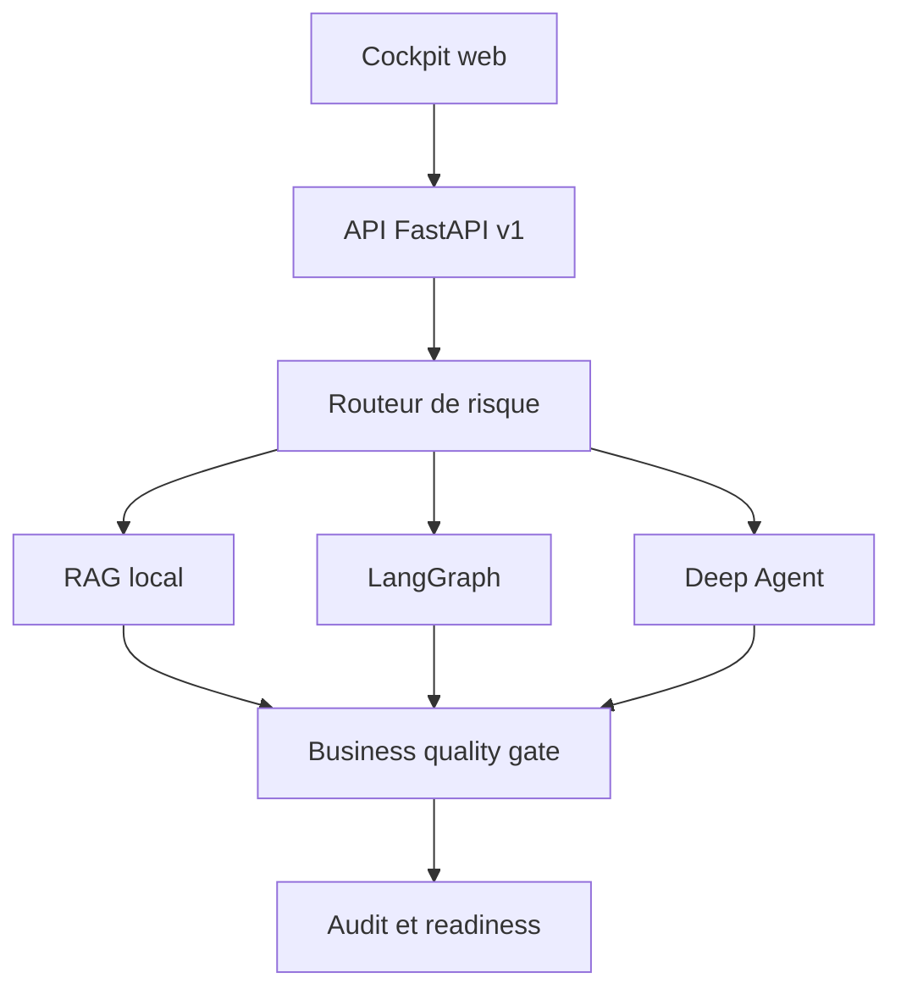

# Asteria Investigation OS

Plateforme capstone du cours **De LangChain aux Deep Agents**. Elle rassemble une interface web,
une API FastAPI versionnee, un moteur RAG, un workflow LangGraph, un Deep Agent, des citations,
des garde-fous humains, un journal d'audit et une suite de tests metier.

Le corpus et les decisions sont fictifs. La plateforme aide a structurer une investigation ;
elle ne prend jamais seule une decision de fraude ou d'indemnisation.

## Demarrage local

```bash
python -m pip install -e ".[dev,api]"
python projects/07-asteria-investigation-platform/app.py serve --reload
```

Ouvrir ensuite `http://127.0.0.1:8000`. La documentation OpenAPI est disponible sur
`http://127.0.0.1:8000/api/docs`.

## CLI

```bash
python projects/07-asteria-investigation-platform/app.py ask \
  "Quelle est la franchise pour un degat des eaux ?"

python projects/07-asteria-investigation-platform/app.py ask \
  "Un score automatique peut-il prouver une fraude ?" --mode deep_agent

python projects/07-asteria-investigation-platform/app.py evaluate
python projects/07-asteria-investigation-platform/app.py readiness
```

Le mode `auto` choisit le moteur le plus petit compatible avec le niveau de risque :

| Moteur | Usage principal | Sortie |
|---|---|---|
| RAG | question factuelle ciblee | reponse citee ou revue |
| LangGraph | processus, dossier, validation | workflow route et auditable |
| Deep Agent | analyse longue ou sensible | plan, sous-agents, fichiers, quality gate |

## API

| Methode | Route | Auth | Role |
|---|---|:---:|---|
| `GET` | `/health` | non | liveness |
| `GET` | `/ready` | non | readiness et blocages |
| `GET` | `/api/v1/platform` | non | metadonnees publiques |
| `GET` | `/api/v1/scenarios` | non | catalogue des tests metier |
| `POST` | `/api/v1/investigations` | oui en production | investigation unifiee |
| `POST` | `/api/v1/evaluations` | oui en production | release gate metier |

L'authentification est activee lorsque `ASTERIA_API_TOKEN` existe :

```bash
curl -X POST http://127.0.0.1:8000/api/v1/investigations \
  -H "Authorization: Bearer $ASTERIA_API_TOKEN" \
  -H "Content-Type: application/json" \
  -d '{"question":"Quelle est la franchise degat des eaux ?","mode":"auto"}'
```

## Tests metier

```bash
python -m pytest tests/test_capstone_platform.py
python projects/07-asteria-investigation-platform/app.py evaluate
```

Le release gate couvre quatre comportements : reponse citee, workflow dossier, revue obligatoire
sur la fraude et refus controle hors corpus. Une mise en production est bloquee si un scenario ou
un invariant de citation, d'audit, de securite ou de readiness echoue.

## Docker

Depuis la racine du depot :

```bash
docker compose -f projects/07-asteria-investigation-platform/docker-compose.yml up --build
```

Le conteneur tourne avec un utilisateur non privilegie et expose un `HEALTHCHECK` sur `/health`.

## LangGraph et LangSmith Deployment

Le fichier `langgraph.json` exporte `agent.py:graph` avec interruption humaine. Pour le developpement
local, utiliser `langgraph dev --config projects/07-asteria-investigation-platform/langgraph.json`.
Pour un deploiement gere, importer le depot dans LangSmith et indiquer le chemin complet de ce
fichier de configuration.

## Architecture



Les traitements deterministes rendent le projet executable en CI sans cle API. Les connecteurs
OpenAI et LangSmith du reste du cours peuvent ensuite remplacer les composants locaux sans changer
le contrat public `CapstoneRequest` / `CapstoneResponse`.
